# Instrucciones para construir la plataforma web (frontend, backend y Docker)

Sistema web para analizar videos de la prueba de nado forzado (FST, por sus siglas en
inglés) del Laboratorio de Bioquímica Estructural, Sección de Posgrado, ENMyH-IPN.
Proyecto TT 2026-B066, ESCOM-IPN.

**Este archivo es el único contexto que tienes.** Todo lo que necesitas (reglas, datos,
diagramas, pantallas) está aquí. No busques ni esperes otros documentos. Si algo falta,
pregunta al usuario; no lo inventes.

---

## 0. Cómo usar este archivo

1. Construye en el orden de la sección 12.
2. Lo marcado **[ABIERTO]** no está decidido. Pregunta al usuario o déjalo configurable y
   anótalo en tu resumen final.
3. Lo marcado **[PROPUESTA]** lo sugiere este documento y nadie lo ha aprobado. Puedes
   cambiarlo si hay razón técnica, pero dilo.
4. El usuario tiene TDAH. Responde corto, empieza por la acción, numera los pasos y
   termina con una sola cosa que pueda hacer ahora.
5. Los diagramas completos en código PlantUML están en el **Anexo A (sección 13)**. Los
   diagramas Mermaid del cuerpo son vistas rápidas; si hay diferencia, manda el anexo.
6. El SQL completo está en el **Anexo B (sección 14)** y la base de Docker (compose,
   Dockerfiles, nginx y variables) en el **Anexo C (sección 15)**. Ninguno está probado.

## 1. Qué se construye y qué no

**Se construye:** frontend (React), backend (Flask), base de datos (PostgreSQL),
orquestación (Docker Compose) y las tareas programadas.

**No se construye:** el análisis de video ni el clasificador de conductas. Eso es el
**worker**, lo hace otra persona. Para ti el worker es una caja negra con un contrato
claro (sección 4). Para probar, escribe un **worker simulado** (`worker_fake`) que cumpla
ese contrato con datos inventados.

Quién usa el sistema:
- **Investigador:** sube videos y consulta resultados.
- **Administrador:** todo lo del investigador, más gestionar cuentas y ver el estado del
  sistema.

Máximo 4 usuarios trabajando al mismo tiempo. El uso simultáneo estricto no se requiere:
los análisis se encolan y se procesan uno por uno.

Qué es un experimento, en una frase: un laboratorio prueba una sustancia o tratamiento en
tres tipos de grupos de especímenes (control, referencia y tratamiento experimental),
graba cada tanda en video en dos sesiones (Día 1 de 20 min y Día 2 de 5 min) y necesita
saber cuánto tiempo pasa cada espécimen nadando, inmóvil o escalando.

## 2. Stack y contenedores

| Contenedor | Tecnología | Responsabilidad |
|---|---|---|
| `frontend` | React.js + Vite | Interfaz. Habla con el backend solo por API REST (JSON). |
| `backend` | Flask + SQLAlchemy + Flask-JWT-Extended | API REST, autenticación, validación de archivos, crea los análisis "en cola". |
| `worker` | Python (lo hace otra persona) | Toma análisis en cola, los procesa, escribe resultados. |
| `db` | PostgreSQL | Todos los datos. Los videos NO se guardan aquí. |
| `mailhog` (solo desarrollo) | MailHog | Servidor de correo falso para ver los mensajes sin enviar nada (sección 11, punto 2). |

Volúmenes:
- `videos_reportes` (compartido backend y worker): videos `.mp4` y `.mov`, videos anotados,
  reportes PDF/CSV/XLSX y reportes de diagnóstico PDF.
- `modelos` (solo lectura, solo para el worker): modelos entrenados.
- `pgdata`: datos de PostgreSQL.

Despliegue: todo se levanta con `docker compose up`. El laboratorio no instala nada más
que Docker. Debe funcionar en el servidor institucional de la ESCOM y en al menos un
entorno más. No hay Redis ni cola de mensajes: **la cola es la tabla `ANALISIS`**
(polling).

Disponibilidad objetivo: 24/7, 95 % mensual. Navegadores: Chrome, Firefox y Edge en sus
versiones actuales, sin instalar nada en el equipo del usuario. Solo escritorio, no hay
versión móvil.

Rendimiento: las operaciones interactivas (abrir el dashboard, filtrar, abrir resultados)
responden en 3 s o menos en el 95 % de los casos. El tiempo de procesamiento del video no
es prioridad.

**Volumen esperado (orientativo, no es regla).** Cada video trae de 2 a 4 especímenes. Un
experimento genera de 6 a 9 videos de Día 2. En un semestre de actividad regular pueden
juntarse alrededor de 32 a 40 videos, pero el laboratorio no tiene calendario fijo. Úsalo
solo para dimensionar disco; no pongas límites en el código con estas cifras.

**Variables de entorno [PROPUESTA].** Nada de esto va escrito en el código; todo sale de
`.env` (con un `.env.example` de muestra):
- `JWT_EXPIRES_HOURS` (por defecto 168, una semana) y `JWT_SECRET`.
- `DATABASE_URL` o sus partes (host, puerto, usuario, contraseña, nombre).
- `SMTP_HOST`, `SMTP_PORT`, `SMTP_USER`, `SMTP_PASSWORD`, `SMTP_FROM`.
- `MAX_UPLOAD_MB` (límite de tamaño de video, sin valor definido todavía).
- `DISK_ALERT_PERCENT=80` y `DISK_CLEANUP_PERCENT=90`.
- `RESET_LINK_MINUTES` (vigencia del enlace de recuperar contraseña, por defecto 60).

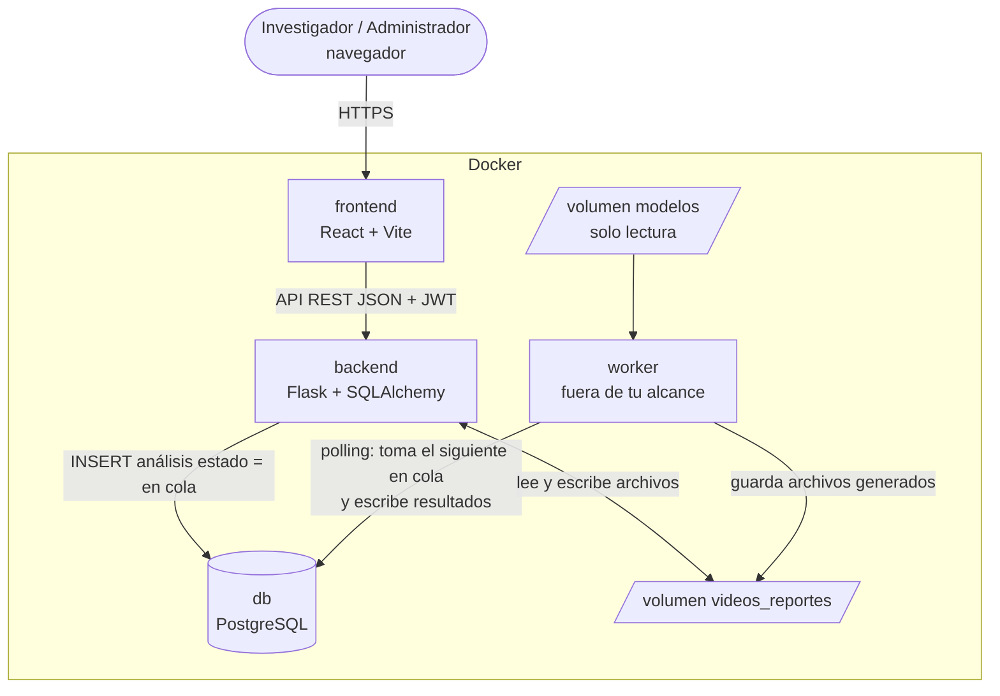
```mermaid
flowchart TB
  INV([Investigador / Administrador<br/>navegador]) -->|HTTPS| FE
  subgraph Docker
    FE[frontend<br/>React + Vite] -->|API REST JSON + JWT| BE[backend<br/>Flask + SQLAlchemy]
    BE -->|INSERT análisis estado = en cola| DB[(db<br/>PostgreSQL)]
    WK[worker<br/>fuera de tu alcance] -->|polling: toma el siguiente en cola<br/>y escribe resultados| DB
    BE <-->|lee y escribe archivos| FS[/volumen videos_reportes/]
    WK -->|guarda archivos generados| FS
    MD[/volumen modelos<br/>solo lectura/] --> WK
  end
```

## 3. Estructura de repositorio sugerida [PROPUESTA]

```
web/
  docker-compose.yml
  .env.example
  backend/        app Flask, modelos SQLAlchemy, rutas, tareas programadas
  frontend/       app React + Vite
  worker_fake/    simulador del worker para pruebas
  db/init/        SQL de creación (dominios, tablas, disparador, semillas)
```

## 4. Contrato con el worker

El backend y el worker no se llaman entre sí. Se comunican **solo a través de la base de
datos y del volumen**.

**Lo que hace el backend al subir un video válido:**
1. Guarda el archivo en `videos_reportes`.
2. Guarda grupo (si es nuevo), tanda (nueva o existente) y video.
3. Crea una fila en `ANALISIS` con `estado = 'en cola'` y el `idVideo` del video.
4. Responde al frontend y el frontend redirige a la pantalla de progreso.

**Lo que hace el worker (tú lo simulas con `worker_fake`):**
1. Cada cierto tiempo busca un `ANALISIS` con `estado = 'en cola'`.
2. Lo pasa a `procesando` y va actualizando `etapa` en este orden:
   `preprocesamiento`, `cilindros`, `clasificacion`.
3. Analiza **solo los primeros 300 segundos** del video; si dura más, descarta el resto.
   Ya no existe un umbral de confianza de detección. Si no puede abrir el video o no
   encuentra los tubos: genera el PDF de diagnóstico, llena `rutaDiagnostico`, pasa a
   `error` y crea una `NOTIFICACION` de tipo `error del pipeline`. No hay reintento ni
   intervención humana en esta versión (sección 11, punto 14).
4. Si todo sale bien, por cada espécimen:
   - escribe una `OBSERVACION` del video;
   - escribe **una fila en `SEGUNDO` por cada segundo analizado** (hasta 300), con
     `clase` (la conducta, o nula si "no se ve"), `propuesta` igual a `clase` (también
     nula cuando el worker no clasificó ese segundo) y `origen = 'maquina'`;
   - escribe los 5 `INTERVALO` (minutos 1 a 5) y, en `PRESENTA`, **una fila por cada
     una de las cuatro conductas**, incluso con 0 segundos, con el conteo de segundos de
     ese minuto. Un mismo análisis puede mezclar las cuatro conductas.

   Después guarda `nivelClasif` (sección 11, punto 15), genera los archivos auxiliares
   (puntos 16 y 17 de la sección 11), pasa a `completado` y crea una `NOTIFICACION` de
   tipo `analisis completado`.
5. Al pasar a `completado` o a `error`, fija `fechaAnalisis = ahora`. Sin esa fecha el
   borrado a los 30 días nunca se dispara, y la base rechaza un `completado` sin ella.

**Umbral de decisión.** El worker acepta una conducta para un segundo cuando su
probabilidad llega a **0.80**. Es una **constante del worker**: no se guarda en la base de
datos, no se configura desde la interfaz y el backend no la conoce. Lo mismo pasa con el
archivo del modelo entrenado. Antes existían las tablas `MODELO` y `CONFIGURACION` para
guardarlos; **ya no existen** (ningún requisito permite cambiar el modelo ni el umbral).

En cada instante un espécimen está en exactamente una conducta: nado activo, inmovilidad,
escalamiento o conducta activa (no inmóvil, sin decidir entre nado y escalamiento). Por
eso, en un intervalo de un minuto, la suma de segundos de sus conductas no pasa de 60. Si
hay segundos en los que el espécimen no se ve, la suma queda por debajo de 60.

**El backend nunca escribe `estado`, `etapa` ni `nivelClasif` salvo al crear el análisis
en cola.**

Estados válidos de un análisis (`estado_analisis`): `en cola`, `procesando`,
`completado`, `error`. No hay transición de regreso (regla R-04).

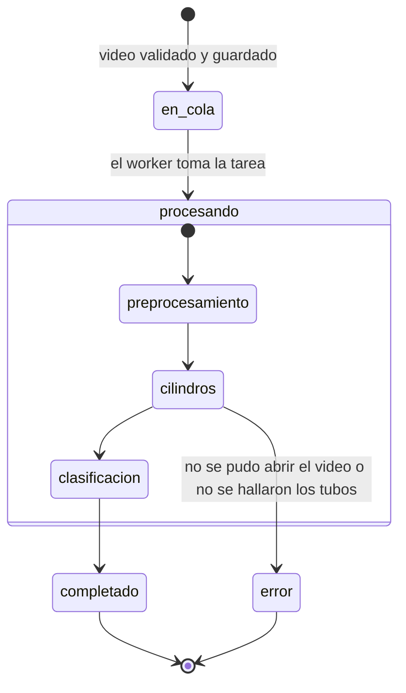
```mermaid
stateDiagram-v2
  [*] --> en_cola: video validado y guardado
  en_cola --> procesando: el worker toma la tarea
  state procesando {
    [*] --> preprocesamiento
    preprocesamiento --> cilindros
    cilindros --> clasificacion
  }
  cilindros --> error: no se pudo abrir el video o no se hallaron los tubos
  clasificacion --> completado
  completado --> [*]
  error --> [*]
```

El estado de un **experimento** no se guarda: se calcula a partir de los análisis de
todas sus tandas, con precedencia `error` > `procesando` > `en cola` > `completado`.
Un experimento sin videos se muestra como "sin videos".

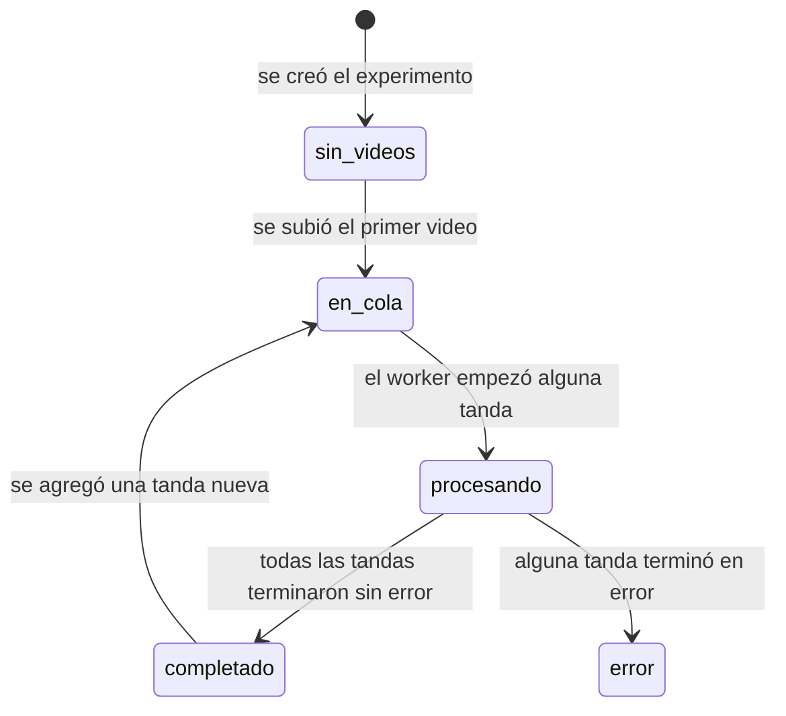
```mermaid
stateDiagram-v2
  [*] --> sin_videos: se creó el experimento
  sin_videos --> en_cola: se subió el primer video
  en_cola --> procesando: el worker empezó alguna tanda
  procesando --> completado: todas las tandas terminaron sin error
  procesando --> error: alguna tanda terminó en error
  completado --> en_cola: se agregó una tanda nueva
```

Mientras alguna tanda siga en error, el experimento sigue en `error`.

## 5. Modelo de datos (PostgreSQL)

15 tablas. Esta es la única versión vigente.

**Jerarquía:** un experimento tiene grupos; un grupo tiene tandas; una tanda tiene
especímenes y hasta dos videos (Día 1 y Día 2); un video tiene un análisis y, por cada
espécimen, una observación con 5 intervalos y sus segundos por conducta.

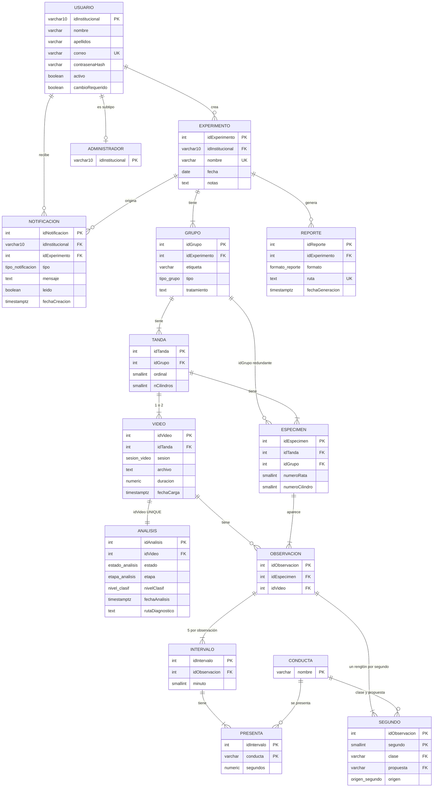
```mermaid
erDiagram
  USUARIO ||--o{ EXPERIMENTO : crea
  USUARIO ||--o{ NOTIFICACION : recibe
  USUARIO ||--o| ADMINISTRADOR : "es subtipo"
  EXPERIMENTO ||--|{ GRUPO : tiene
  EXPERIMENTO ||--o{ REPORTE : genera
  EXPERIMENTO ||--o{ NOTIFICACION : origina
  GRUPO ||--|{ TANDA : tiene
  GRUPO ||--o{ ESPECIMEN : "idGrupo redundante"
  TANDA ||--|{ ESPECIMEN : tiene
  TANDA ||--|{ VIDEO : "1 o 2"
  VIDEO ||--|| ANALISIS : "idVideo UNIQUE"
  VIDEO ||--o{ OBSERVACION : tiene
  ESPECIMEN ||--|{ OBSERVACION : aparece
  OBSERVACION ||--|{ INTERVALO : "5 por observación"
  INTERVALO ||--|{ PRESENTA : tiene
  CONDUCTA ||--o{ PRESENTA : "se presenta"
  OBSERVACION ||--|{ SEGUNDO : "un renglón por segundo"
  CONDUCTA ||--o{ SEGUNDO : "clase y propuesta"

  USUARIO { varchar10 idInstitucional PK
            varchar nombre
            varchar apellidos
            varchar correo UK
            varchar contrasenaHash
            boolean activo
            boolean cambioRequerido }
  EXPERIMENTO { int idExperimento PK
                varchar10 idInstitucional FK
                varchar nombre UK
                date fecha
                text notas }
  GRUPO { int idGrupo PK
          int idExperimento FK
          varchar etiqueta
          tipo_grupo tipo
          text tratamiento }
  TANDA { int idTanda PK
          int idGrupo FK
          smallint ordinal
          smallint nCilindros }
  ESPECIMEN { int idEspecimen PK
              int idTanda FK
              int idGrupo FK
              smallint numeroRata
              smallint numeroCilindro }
  VIDEO { int idVideo PK
          int idTanda FK
          sesion_video sesion
          text archivo
          numeric duracion
          timestamptz fechaCarga }
  ANALISIS { int idAnalisis PK
             int idVideo FK
             estado_analisis estado
             etapa_analisis etapa
             nivel_clasif nivelClasif
             timestamptz fechaAnalisis
             text rutaDiagnostico }
  OBSERVACION { int idObservacion PK
                int idEspecimen FK
                int idVideo FK }
  INTERVALO { int idIntervalo PK
              int idObservacion FK
              smallint minuto }
  CONDUCTA { varchar nombre PK }
  PRESENTA { int idIntervalo PK
             varchar conducta PK
             numeric segundos }
  SEGUNDO { int idObservacion PK
            smallint segundo PK
            varchar clase FK
            varchar propuesta FK
            origen_segundo origen }
  ADMINISTRADOR { varchar10 idInstitucional PK }
  REPORTE { int idReporte PK
            int idExperimento FK
            formato_reporte formato
            text ruta UK
            timestamptz fechaGeneracion }
  NOTIFICACION { int idNotificacion PK
                 varchar10 idInstitucional FK
                 int idExperimento FK
                 tipo_notificacion tipo
                 text mensaje
                 boolean leido
                 timestamptz fechaCreacion }
```

`VIDEO.archivo` admite nulo: queda vacío cuando el video ya se borró (a los 30 días o
antes, si el disco pasa del 90 %). La fila de `VIDEO` se conserva porque los resultados la
referencian. `SEGUNDO.propuesta` también admite nulo: el worker no clasificó ese segundo.

La columna `ESPECIMEN.numeroRata` se llama así en la base y no se renombra. En la interfaz
nunca se muestra ese nombre: se muestra "Espécimen N".

### Tipos y convenciones
- Id sustituto: `integer GENERATED ALWAYS AS IDENTITY`.
- `USUARIO.idInstitucional`: `varchar(10)`, es la llave primaria (identificador institucional).
- Fechas sin hora: `date`. Marcas de tiempo: `timestamptz`. Duraciones y segundos: `numeric`, nunca `float`.
- **Todas** las llaves foráneas son `ON UPDATE NO ACTION ON DELETE NO ACTION`. La base
  rechaza el borrado en vez de propagarlo. Por eso `USUARIO.activo` existe: dar de baja
  sin borrar. Para borrar un experimento, la aplicación debe borrar de las hojas hacia
  arriba: `SEGUNDO`, `PRESENTA`, `INTERVALO`, `OBSERVACION`, `ANALISIS`, `VIDEO`, `ESPECIMEN`,
  `TANDA`, `GRUPO`, `REPORTE`, `NOTIFICACION`, `EXPERIMENTO`.
- Contraseñas con **bcrypt + sal**. Nunca texto plano.

### Dominios cerrados (`CREATE DOMAIN ... CHECK`)
| Dominio | Valores |
|---|---|
| `tipo_grupo` | `control`, `referencia`, `tratamiento experimental` |
| `sesion_video` | `Dia 1`, `Dia 2` |
| `formato_reporte` | `CSV`, `XLSX`, `PDF` |
| `tipo_notificacion` | `analisis completado`, `error del pipeline`, `alerta de disco`, `video borrado` |
| `estado_analisis` | `en cola`, `procesando`, `completado`, `error` |
| `etapa_analisis` | `preprocesamiento`, `cilindros`, `clasificacion` |
| `nivel_clasif_analisis` | `preciso`, `agrupado` |
| `origen_segundo` | `maquina`, `humano_confirma`, `humano_corrige`, `humano_duda`, `sin_revisar`, `humano_ciego` |

`CONDUCTA` es tabla y no dominio. Valores iniciales: `nado activo`, `inmovilidad`,
`escalamiento` y `conducta activa`. Cada intervalo (`INTERVALO`) tiene en `PRESENTA` una
fila por cada una de las cuatro conductas, **incluso con 0 segundos** (en el diseño la
cardinalidad se declara 2..4, pero en la práctica son siempre 4).

`SEGUNDO` guarda la etiqueta de cada espécimen en cada segundo analizado (hasta 300 por
observación). Es la fuente de la pantalla de revisión; `PRESENTA` es su resumen por minuto
y se recalcula cada vez que el usuario guarda correcciones. Valores de `origen`:
`maquina`, `humano_confirma`, `humano_corrige`, `humano_duda` (el usuario dejó el segundo
vacío a propósito), `sin_revisar` y `humano_ciego` (revisión "desde cero", que oculta lo
que propuso la máquina). `clase` nula significa que el segundo no tiene conducta: la
máquina no pudo decidir, o el usuario lo marcó "dudosa" (`humano_duda`).

### Restricciones que la base debe hacer cumplir
- `ANALISIS.idVideo` es `UNIQUE`: un video, un análisis. Reanalizar **reemplaza** el
  resultado anterior, no hay historial.
- `GRUPO`: `UNIQUE (idExperimento, etiqueta)`. `TANDA`: `UNIQUE (idGrupo, ordinal)`.
- `VIDEO`: `UNIQUE (idTanda, sesion)`. `OBSERVACION`: `UNIQUE (idEspecimen, idVideo)`.
- `INTERVALO`: `UNIQUE (idObservacion, minuto)`.
- `ESPECIMEN`: `UNIQUE (idTanda, numeroCilindro)` y `UNIQUE (idGrupo, numeroRata)`,
  con `numeroRata >= 1`. `idGrupo` en `ESPECIMEN` es redundante a propósito: lo mantiene
  un disparador `BEFORE INSERT OR UPDATE OF idTanda` que copia el `idGrupo` de la tanda,
  así la aplicación no necesita mandarlo.
- `EXPERIMENTO.nombre` es `UNIQUE` en todo el sistema.
- `ANALISIS.rutaDiagnostico` solo se llena cuando `estado = 'error'`.
- `ADMINISTRADOR` es subtipo: su llave primaria es la misma llave foránea a `USUARIO`.

### Cardinalidades
- `EXPERIMENTO` tiene 3 o más grupos.
- `GRUPO` tiene **1 o más tandas** (la tanda B y siguientes son opcionales).
- `TANDA` tiene de **2 a 4 especímenes** (ese es el rango de `nCilindros`) y de 1 a 2 videos.
- `GRUPO` tiene **2 o más especímenes**, sin tope.
- `VIDEO` tiene de 2 a 4 observaciones (una por espécimen) y un análisis.

El mínimo de 2 por grupo se da cuando el grupo tiene una sola tanda (la A) con 2
especímenes. Cualquier total de 2 en adelante se puede repartir en tandas de 2 a 4 (por
ejemplo, 5 = 3 + 2), así que las reglas son compatibles. El laboratorio mencionó que 6
especímenes por grupo es lo habitual como mínimo útil, pero el equipo decidió modelar el
mínimo estructural en 2: no obligues a 6.

Las cardinalidades mínimas no se pueden forzar con `FOREIGN KEY`: valídalas en la
aplicación al guardar y no pongas `CHECK` de conteo en la base.

## 6. API REST

Reglas generales:
- Todo requiere JWT, salvo `POST /auth/login` y `POST /auth/recover`.
- Respuesta JSON con tres campos: `data` (resultado), `error` (mensaje) y `status` (código HTTP).
- Errores de login con mensaje **genérico**, sin decir si falló el correo o la contraseña (R-01).

| Método | Ruta | Descripción | Acceso |
|---|---|---|---|
| POST | `/auth/login` | Inicia sesión, devuelve JWT | Público |
| POST | `/auth/logout` | Cierra sesión. El cliente descarta el token; no hay lista de bloqueo (sección 11, punto 1) | Autenticado |
| POST | `/auth/recover` | Envía enlace de recuperación por correo | Público |
| PATCH | `/auth/password` | Cambia la contraseña del usuario autenticado | Autenticado |
| GET | `/experiments` | Lista todos los experimentos del laboratorio | Investigador |
| POST | `/experiments` | Crea experimento (nombre único, fecha, notas opcionales) | Investigador |
| GET | `/experiments/{id}` | Detalle y estado del experimento | Investigador |
| POST | `/experiments/{id}/groups/{grupo}/videos` | Sube un video (Día 1 o Día 2) a una tanda del grupo; crea la tanda si no existe y encola el análisis | Investigador |
| GET | `/experiments/{id}/status` | Progreso de los análisis en porcentaje | Investigador |
| GET | `/experiments/{id}/results` | Resultados por espécimen y conducta | Investigador |
| GET | `/experiments/{id}/results/byminute` | Desglose por minuto | Investigador |
| GET | `/experiments/{id}/groups/{grupo}/tandas/{tanda}/comparison` | Comparación Día 1 vs Día 2 de esa tanda | Investigador |
| GET | `/experiments/{id}/report/pdf` | Descarga reporte PDF | Investigador |
| GET | `/experiments/{id}/report/csv` | Descarga CSV | Investigador |
| GET | `/experiments/{id}/report/xlsx` | Descarga XLSX | Investigador |
| GET | `/admin/users` | Lista usuarios (filtros: rol, estado) | Admin |
| POST | `/admin/users` | Crea cuenta con contraseña temporal | Admin |
| PATCH | `/admin/users/{id}` | Modifica datos o desactiva cuenta | Admin |
| GET | `/admin/system` | Métricas: disco y cola | Admin |

**Importante:** el rol Administrador es un permiso de **backend**. Ocultar la sección en
la interfaz no basta. Cada ruta `/admin/*` debe verificar en la base que el
`idInstitucional` de la sesión esté en `ADMINISTRADOR` y responder 403 si no.

### Rutas que faltan en la tabla pero la funcionalidad necesita [PROPUESTA]
Estos nombres los propone este documento; confírmalos con el usuario:

| Necesidad | Ruta propuesta |
|---|---|
| Completar la recuperación de contraseña con el enlace | `POST /auth/reset` |
| Actualizar nombre y correo del perfil propio | `PATCH /users/me` |
| Eliminar un experimento | `DELETE /experiments/{id}` |
| Listar y marcar notificaciones como leídas | `GET /notifications`, `PATCH /notifications/{id}` |
| Descargar el PDF de diagnóstico de un análisis | `GET /experiments/{id}/analyses/{idAnalisis}/diagnostic` |
| Sugerir grupos con nombre parecido y la siguiente tanda | `GET /experiments/{id}/groups?q=` |
| Comparación entre los tres grupos (solo Día 2) | `GET /experiments/{id}/groups/comparison` |
| Datos de la pantalla de revisión: especímenes, etiquetas por segundo y recuadros de los tubos | `GET /experiments/{id}/analyses/{idAnalisis}/review` |
| Video para la pantalla de revisión (con soporte de `Range`, para poder adelantar y retroceder) | `GET /experiments/{id}/analyses/{idAnalisis}/video` |
| Guardar las correcciones por segundo | `PUT /experiments/{id}/analyses/{idAnalisis}/segundos` |

## 7. Reglas de negocio que el backend debe cumplir

| ID | Regla |
|---|---|
| R-01 | Credenciales incorrectas: mensaje genérico, sin decir si falló el correo o la contraseña. |
| R-02 | Un video pertenece a exactamente una tanda. No se reutiliza en otra. |
| R-03 | Una tanda tiene como máximo 2 videos: Día 1 (20 min) y Día 2 (5 min). Ambos son opcionales individualmente. El Día 1 solo se analiza (sus primeros 5 min) si la tanda es del grupo **control**. |
| R-04 | El análisis lo inicia el sistema solo. El investigador **no puede** iniciar, pausar, cancelar ni reiniciar un análisis. No pongas botón de cancelar ni de reiniciar. Lo que sí puede hacer, **cuando el análisis termina**, es corregir las etiquetas por segundo (R-14). |
| R-05 | Los videos se borran 30 días después de un análisis exitoso. Irreversible. Aviso con 7 días o más de anticipación. |
| R-06 | Resultados y reportes se conservan para siempre, aunque el video ya no exista. |
| R-07 | Todos los investigadores activos pueden ver los experimentos de cualquier otro. El administrador además modifica y desactiva cuentas. |
| R-08 | Borrar un experimento es permanente (se van video, resultados y reportes). Pide confirmación explícita. |
| R-09 | Solo se aceptan archivos `.mp4` y `.mov`. La validación de formato ocurre **en el cliente** antes de subir, y el backend la repite. También valida que el video sea reproducible y que esté **en horizontal** (ancho mayor que alto): un video girado (vertical) **no se puede procesar** y se rechaza con un mensaje claro. No hay opción de rotar. |
| R-10 | **Eliminada.** Ya no hay umbral de confianza de detección de cilindros, y nada la sustituye en esta versión (sección 11, punto 14). |
| R-11 | La comparación Día 1 vs Día 2 solo existe si **ambos** videos de la tanda se procesaron con éxito. |
| R-12 | Cuando el clasificador sabe que el espécimen no está inmóvil pero no decide entre nado y escalamiento, esos segundos se guardan como "conducta activa", una cuarta conducta. Un mismo análisis puede mezclar las cuatro. Los reportes deben mostrarla como una columna más. |
| R-13 | Solo se analizan los primeros 300 s de cada video. El resto se descarta. |
| R-14 | Solo se puede revisar un análisis en estado `completado`. Al revisar, el usuario corrige las etiquetas segundo a segundo; cada corrección queda en `SEGUNDO` con `origen` `humano_confirma`, `humano_corrige` o `humano_duda`, y al guardar el backend **recalcula `INTERVALO` y `PRESENTA`** de esos especímenes dentro de la misma transacción. La etiqueta original de la máquina nunca se pierde: queda en `propuesta`. |

Otras decisiones tomadas:
- **Progreso:** el backend calcula el porcentaje por análisis como **un tercio fijo por
  etapa** (33 %, 67 %, 100 %). Es un cálculo del backend, no un dato guardado.
- **Comparación entre grupos (solo Día 2):** se **promedia** por grupo (no se suma), para
  que el tamaño del grupo no distorsione. Los especímenes sin resultado se marcan como
  dato faltante. Si un grupo mezcla niveles `preciso` y `agrupado`, se separan los
  resultados por nivel y se avisa.
- **Reportes:** se guardan en `REPORTE`. Al pedir uno: si no existe, se genera; si es más
  viejo que el último análisis del experimento, se regenera y se reemplaza; si sigue
  vigente, se devuelve el guardado.
- **Contenido de los reportes:** CSV y XLSX con datos por espécimen y desglose por minuto
  (columnas `Tiempo (min:seg)`, `Nado`, `Escalamiento`, `Inmovilidad`, una fila por
  minuto) más estadísticas por grupo: media, desviación estándar y varianza del tiempo de
  cada conducta entre los especímenes de cada grupo (agregando todas sus tandas). El PDF
  es un resumen ejecutivo, distinto del PDF de diagnóstico.
- **Cuentas:** no existe autoregistro ni formulario público. Solo el administrador crea
  cuentas con identificador institucional (propuesta, sección 11 punto 12), nombre,
  apellidos y correo (de cualquier dominio, D-46); el sistema genera la contraseña temporal. Se pone
  `cambioRequerido = true` y el sistema obliga a cambiarla en el primer ingreso.
- **Recuperación de contraseña:** el enlace lleva su vencimiento **firmado dentro**
  (JWT). No se agregan columnas a `USUARIO`.
- **Desactivar usuario:** `activo = false`. Nunca `DELETE`.
- **Perfil:** el investigador puede actualizar su nombre, correo y contraseña.
- **Crear experimento:** solo pide nombre único, fecha y notas opcionales. El grupo, el
  tratamiento y el número de especímenes de cada tanda (de 2 a 4) se capturan después, al
  subir el primer video de cada grupo.

## 8. Tareas programadas (cron)

| Tarea | Frecuencia | Qué hace |
|---|---|---|
| Borrar videos vencidos | Diaria | Elimina el archivo del video 30 días después de `ANALISIS.fechaAnalisis` si `estado = completado`. La fila de `VIDEO` se conserva y su `archivo` queda en nulo. |
| Aviso de vencimiento | Diaria | Marca los videos a menos de 7 días del borrado para que el dashboard los muestre con nombre del experimento y fecha exacta. |
| Vigilar disco | Periódica | Al superar **80 %**, crea `NOTIFICACION` tipo `alerta de disco` para el administrador. Al superar **90 %**, borra los videos más antiguos (deja `VIDEO.archivo` en nulo) y crea una `NOTIFICACION` tipo `video borrado` para el investigador de cada experimento afectado. |

La fecha de borrado se **deriva** (`fechaAnalisis + 30 días`). No hay columna para ella y
no se debe crear.

## 9. Frontend

Siete pantallas. Estilo sobrio, para escritorio, todo en español. El objetivo es que una
persona sin conocimientos de programación cree un experimento, suba un video, espere y
descargue el reporte sin ayuda. La meta es que 9 de cada 10 personas lo logren sin
asistencia. **No hay mockups: los esquemas de abajo son tu referencia.** Cada pantalla
tiene varios estados; impleméntalos todos.

Estructura común: barra superior con el nombre del sistema, notificaciones (campana) y
menú de usuario con "Cerrar sesión" accesible desde cualquier pantalla.

### 9.1 Inicio de sesión
Estados: normal; error genérico de credenciales. Incluye enlace "Recuperar contraseña".

```
+----------------------------------+
|   Sistema de análisis FST        |
|                                  |
|  Correo electrónico              |
|  [ nombre@ejemplo.com        ]   |
|  Contraseña                      |
|  [ ••••••••                  ]   |
|  (!) Credenciales incorrectas    |  <- solo en el estado de error
|  [        Iniciar sesión     ]   |
|  ¿Olvidaste tu contraseña?       |
+----------------------------------+
```

Si la cuenta tiene `cambioRequerido = true`, tras entrar obliga a cambiar la contraseña
antes de continuar.

### 9.2 Dashboard
Estados: con experimentos; vacío ("Aún no hay experimentos" y botón de crear); con aviso de
video por vencer.

```
+-------------------------------------------------------------+
| [+ Nuevo experimento]    Filtros: [Estado v][Fecha v][Trat. v]|
| (!) El video del experimento "X" se borra el 12/11/2026      |  <- aviso (menos de 7 días)
|-------------------------------------------------------------|
| Nombre      | Fecha      | Grupos | Estado      | Acciones   |
| Exp. A      | 01/10/2026 | 3      | Completado  | Ver | CSV  |
| Exp. B      | 28/09/2026 | 3      | Procesando  | Ver        |
| Exp. C      | 20/09/2026 | 4      | Con error   | Ver | Elim.|
|-------------------------------------------------------------|
| < 1 2 3 >                                                    |
+-------------------------------------------------------------+
```

Lista **todos** los experimentos del laboratorio (de cualquier investigador). El estado se
calcula (sección 4). El filtro por tratamiento muestra los experimentos que tengan al
menos un grupo con ese tratamiento. "Eliminar" pide confirmación explícita (R-08).

### 9.3 Crear experimento
Se hace en pasos, porque subir un video puede tardar varios minutos y así se puede corregir
el nombre o la fecha sin volver a subir nada, y agregar tandas después.

```
Paso 1: Datos del experimento
  Nombre* [__________]   Fecha* [__/__/____]   Notas [__________]
  [Continuar]

Paso 2: Grupo, tanda y video   (se repite por cada tanda)
  Grupo* [ Control        v]   Tratamiento* [____________]
  Tanda sugerida: [ B ]  (editable)  -> "¿Esta es la tanda B de Control?" [Confirmar]
  Especímenes en esta tanda: [ 2 a 4 ]
  Sesión*  (o) Día 1   ( ) Día 2
  Archivo*  [Elegir .mp4 o .mov] [=======>      ] 45 %   <- progreso de subida
  [Subir y analizar]            [+ Agregar otra tanda]   [Terminar]

Paso 3: Confirmación
  "Video almacenado. El análisis está en cola." -> redirige a Progreso
```

Reglas del paso 2:
- Al escribir el nombre del grupo, si coincide con uno **del mismo experimento**, el
  sistema sugiere la siguiente tanda (letra A, B, C...; en la base es `TANDA.ordinal`
  entero) en un campo editable y **pide confirmación explícita**. Si es grupo nuevo, la
  primera tanda es la "A" y se piden tipo (control, referencia o tratamiento
  experimental) y tratamiento.
- Rechaza en el cliente cualquier archivo que no sea `.mp4` o `.mov`, con un mensaje
  específico, antes de subir. También rechaza un video en vertical (alto mayor que ancho),
  que se puede detectar en el navegador al cargar los metadatos; el backend lo repite.
- Muestra errores de validación por campo (campos obligatorios vacíos).
- Estados: vacío, lleno, subiendo, error de formato, errores de campo, éxito.

### 9.4 Progreso del análisis
Estados: analizando; completado; error (no se pudo abrir el video o no se hallaron los
tubos). ~~Esta pantalla cambiará si se adopta el análisis en pantalla con intervención
humana~~ **Resuelto por la sección 11, punto 14:** en esta versión no hay análisis en
pantalla ni intervención humana, así que la pantalla se queda como está.

```
+-------------------------------------------------------------+
| Experimento A / Control / Tanda A / Día 2                    |
| Etapas:  [x] Preprocesamiento  [>] Cilindros                 |
|          [ ] Clasificación                                   |
| [===================>         ] 67 %                          |
|-------------------------------------------------------------|
| (si hay error)                                                |
| No se pudieron encontrar los tubos en el video                |
| [Descargar reporte de diagnóstico (PDF)]                      |
+-------------------------------------------------------------+
```

- Consulta el backend cada **3 a 5 segundos** mientras haya análisis en cola o procesando.
- Una barra por video. Cada etapa vale un tercio.
- **Sin botón de cancelar ni de reiniciar** (R-04). El análisis sigue aunque se cierre la
  pestaña.
- En error: el mensaje se **arma a partir de `etapa`** del análisis (no hay columna de
  código ni de descripción de error). Los errores definidos son: el video no se pudo abrir
  y no se hallaron los tubos. Debajo, el botón del PDF de diagnóstico. Si el PDF aún no
  existe, muestra "preparando…" y reintenta solo tras unos segundos.
- No hay "log de ejecución": ninguna tabla lo guarda (sección 11, punto 10).
- Al completarse, habilita "Ver resultados" y "Revisar segundo a segundo" (sección 9.7).

### 9.5 Resultados
Cuatro pestañas. Estados: resumen de un solo día; comparación Día 1 vs Día 2; desglose por
minuto expandido.

```
+-------------------------------------------------------------+
| Exp. A    [Resumen][Por espécimen][Por minuto][Día 1 vs Día 2]|
|                         [PDF] [CSV] [XLSX]                    |
|-------------------------------------------------------------|
| Resumen (Día 2)                                              |
| Espécimen | Nado activo | Inmovilidad | Escalamiento           |
| 1         | 60 s (20 %) | 180 s (60 %)| 60 s (20 %)            |
| 2         | ...                                               |
|-------------------------------------------------------------|
| Por minuto: minuto 1..5 por espécimen y conducta             |
| Día 1 vs Día 2: barras por espécimen (solo si ambos videos   |
|   de la tanda se procesaron con éxito, R-11)                 |
+-------------------------------------------------------------+
```

- Totales en segundos y porcentaje por conducta, por espécimen y por sesión.
- La comparación entre los tres grupos (solo Día 2) muestra el promedio por conducta de
  cada grupo (sección 7) y señala los especímenes con dato faltante.
- "Conducta activa" se muestra como una cuarta columna (segundos en los que el espécimen
  no estaba inmóvil pero el sistema no decidió entre nado y escalamiento), con una nota
  breve que lo explique.
- Descargas en PDF, CSV y XLSX.

### 9.6 Panel de administración (solo administrador)
Estados: vista de métricas; alerta de disco elevado; cola de análisis activa; modal de
crear usuario; modal de editar usuario.

```
+-------------------------------------------------------------+
| Sistema:  Disco [########    ] 82 %  (!) por encima de 80 %  |
|           Libres: 90 GB   Cola: 3   Activos: 1   ETA: 25 min |
|-------------------------------------------------------------|
| Usuarios        Filtros: [Rol v] [Estado v]  [+ Crear cuenta] |
| Correo        | Rol           | Estado  | Experimentos          |
| a@ipn.mx      | Investigador  | Activo  | 5                     |
| b@ipn.mx      | Administrador | Activo  | 2                     |
|-------------------------------------------------------------|
| Experimentos de todos los investigadores (lista y gestión)    |
+-------------------------------------------------------------+
Modal "Crear cuenta":  Identificador institucional*, Nombre*, Apellidos*, Correo*  [Crear]
   (el identificador institucional en el formulario quedó decidido, sección 11, punto 12)
Modal "Editar cuenta": datos editables + interruptor Activo/Inactivo [Guardar]
```

Al crear una cuenta, el sistema envía la contraseña temporal por correo y **además** la
muestra una sola vez en pantalla al administrador, como respaldo (D-45, sección 11, punto 2).

### 9.7 Revisión segundo a segundo
Se abre **solo cuando el análisis está `completado`**, desde Progreso o Resultados
(regla R-14). Es una versión web de una herramienta de revisión que ya existe como página
suelta; aquí lee y guarda en el servidor en vez de usar archivos locales. Tema oscuro,
pantalla completa. Se revisa **un espécimen a la vez**, con el video corriendo.

```
+-------------------------------------------------------------------------+
| Revisión · Exp. A / Control / Tanda A    [Tubo 1][Tubo 2][Tubo 3]        |
| Visto [=======>        ] 60 %   (nado 214 s)(inmov. 70 s)(escal. 29 s)   |
|                                                [Resumen] [Guardar]        |
|-------------------------------------------------------------------------|
|   +-----------------------------------------------------------------+   |
|   |  video, oscurecido salvo un recuadro alrededor del tubo actual  |   |
|   |  [0:42]                                          Ahora: NADO    |   |
|   |                                           (propuesta de máquina)|   |
|   |  (si está en pausa) En pausa: una tecla cambia solo este segundo|   |
|   +-----------------------------------------------------------------+   |
|  Lupa (40 s)  ▓▓▓▓▓░░░░▓▓▓▓▓▓▓▓░░░▓▓▓▓      <- colores por conducta       |
|  Tubo 1 (300 s)  ▓▓▓▓▓▓▓▓░░░░▓▓▓▓▓▓▓▓▓▓▓▓▓▓▓▓░░░▓▓▓▓▓▓▓▓▓▓▓▓▓▓▓▓      |
|-------------------------------------------------------------------------|
| [1 Nado][2 Inmovilidad][3 Escalamiento][4 Activa][0 Dudosa]              |
| Velocidad: 0.5x 0.75x [1x] 1.5x 2x                                       |
| Espacio pausa · ← → 1 s · Shift+flecha 5 s · R vuelve 3 s · Tab sig. tubo|
| Ctrl+Z deshacer · Ctrl+S guardar · clic en la línea = ir a ese segundo   |
+-------------------------------------------------------------------------+
```

Cómo funciona:
- **Cada segundo ya trae una etiqueta propuesta** (la de la máquina). Cuando lo que ves no
  coincide con el cartel "Ahora", pulsas la conducta correcta.
- **Con el video corriendo**, la tecla cambia la etiqueta **desde 0.4 s antes** (lo que
  tarda una persona en reaccionar) hasta el siguiente cambio de color. **En pausa**, la
  tecla cambia **solo el segundo donde estás**, para corregir con precisión.
- **Teclas:** `1` nado, `2` inmovilidad, `3` escalamiento, `4` conducta activa, `0` "no se
  ve". `Espacio` pausa. `←` `→` un segundo, `Shift` + flecha cinco. `R` vuelve 3 s.
  `Tab` cambia de tubo. `Ctrl+Z` deshace. `Ctrl+S` guarda.
- **"Visto"** son los segundos que el cabezal ya dejó atrás a velocidad 2x o menos. Solo lo
  visto se guarda como `humano_confirma` (coincide con la propuesta) o `humano_corrige`
  (la cambiaste). Lo pintado hacia adelante sin verlo queda `sin_revisar`. Un segundo que
  dejas vacío a propósito queda `humano_duda`.
- **Modo "desde cero"** (opcional): oculta lo que propuso la máquina (cartel, colores de la
  línea de tiempo y contadores); lo que marques queda `humano_ciego`.
- **Recuadro del tubo:** viene del archivo `analisis_{idAnalisis}_cajas.json` (sección 11,
  punto 17). Es solo para destacar visualmente al espécimen; no se puede mover.
- **Borrador:** mientras revisas, el avance se guarda en el navegador; al pulsar "Guardar"
  se manda al servidor (`PUT .../segundos`), que actualiza `SEGUNDO` y recalcula los
  totales por minuto.
- **Resumen:** una tabla con los segundos por conducta de cada espécimen antes de guardar.
- Nombres en pantalla: "Nado", "Inmovilidad", "Escalamiento", "Activa", "Dudosa". En la
  base: `nado activo`, `inmovilidad`, `escalamiento`, `conducta activa` y nulo. "Dudosa"
  guarda `clase` nula con `origen = 'humano_duda'`; no existe un botón aparte de "No se
  ve".
- En la base los reportes dicen si el análisis tuvo revisión humana (algún `origen` que
  empiece con `humano`).

### 9.8 Textos de la interfaz (reglas)
- Di **"espécimen"**. Nunca "rata" ni "animal" en ningún texto visible.
- Nunca "inteligencia artificial" ni "IA" en la interfaz.
- Nombre de la institución cuando haga falta: **Laboratorio de Bioquímica Estructural,
  Sección de Posgrado, ENMyH-IPN**.
- Conductas: "Nado activo", "Inmovilidad", "Escalamiento".
- Todo el texto en español.

## 10. Secuencias clave

**Carga de video:**

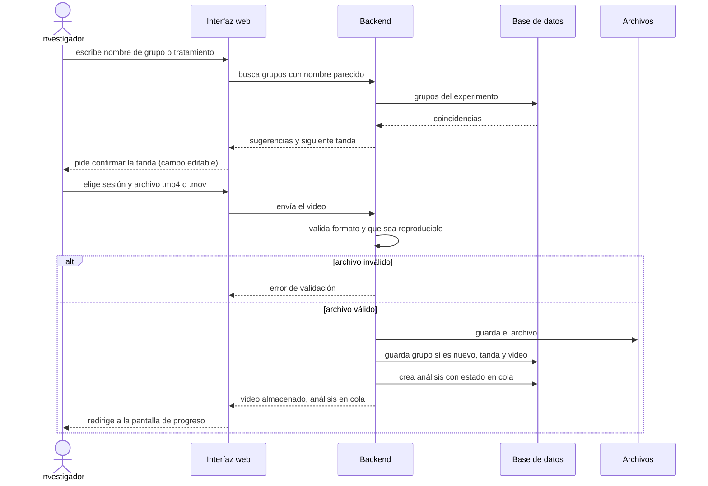
```mermaid
sequenceDiagram
  actor I as Investigador
  participant UI as Interfaz web
  participant API as Backend
  participant DB as Base de datos
  participant FS as Archivos
  I->>UI: escribe nombre de grupo o tratamiento
  UI->>API: busca grupos con nombre parecido
  API->>DB: grupos del experimento
  DB-->>API: coincidencias
  API-->>UI: sugerencias y siguiente tanda
  UI-->>I: pide confirmar la tanda (campo editable)
  I->>UI: elige sesión y archivo .mp4 o .mov
  UI->>API: envía el video
  API->>API: valida formato y que sea reproducible
  alt archivo inválido
    API-->>UI: error de validación
  else archivo válido
    API->>FS: guarda el archivo
    API->>DB: guarda grupo si es nuevo, tanda y video
    API->>DB: crea análisis con estado en cola
    API-->>UI: video almacenado, análisis en cola
    UI-->>I: redirige a la pantalla de progreso
  end
```

**Consulta de progreso (polling cada 3 a 5 s):**

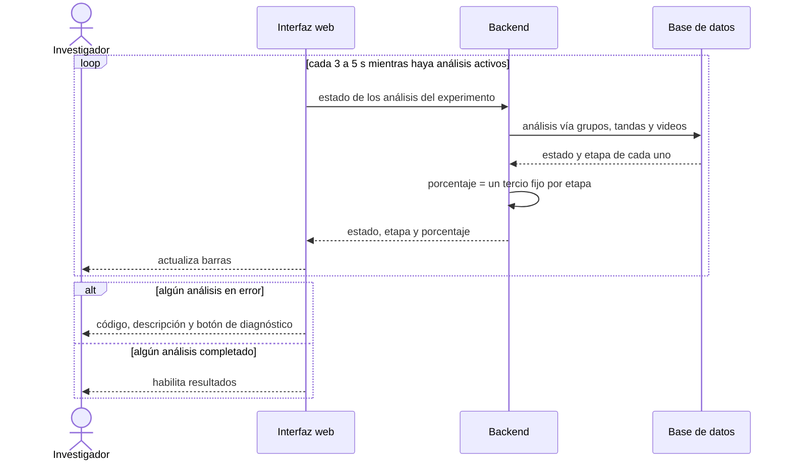
```mermaid
sequenceDiagram
  actor I as Investigador
  participant UI as Interfaz web
  participant API as Backend
  participant DB as Base de datos
  loop cada 3 a 5 s mientras haya análisis activos
    UI->>API: estado de los análisis del experimento
    API->>DB: análisis vía grupos, tandas y videos
    DB-->>API: estado y etapa de cada uno
    API->>API: porcentaje = un tercio fijo por etapa
    API-->>UI: estado, etapa y porcentaje
    UI-->>I: actualiza barras
  end
  alt algún análisis en error
    UI-->>I: código, descripción y botón de diagnóstico
  else algún análisis completado
    UI-->>I: habilita resultados
  end
```

**Descarga de reporte:**

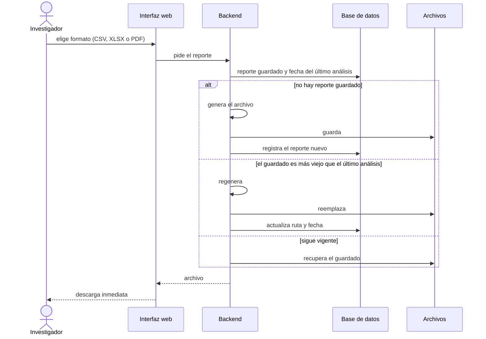
```mermaid
sequenceDiagram
  actor I as Investigador
  participant UI as Interfaz web
  participant API as Backend
  participant DB as Base de datos
  participant FS as Archivos
  I->>UI: elige formato (CSV, XLSX o PDF)
  UI->>API: pide el reporte
  API->>DB: reporte guardado y fecha del último análisis
  alt no hay reporte guardado
    API->>API: genera el archivo
    API->>FS: guarda
    API->>DB: registra el reporte nuevo
  else el guardado es más viejo que el último análisis
    API->>API: regenera
    API->>FS: reemplaza
    API->>DB: actualiza ruta y fecha
  else sigue vigente
    API->>FS: recupera el guardado
  end
  API-->>UI: archivo
  UI-->>I: descarga inmediata
```

**Crear cuenta (solo administrador):**

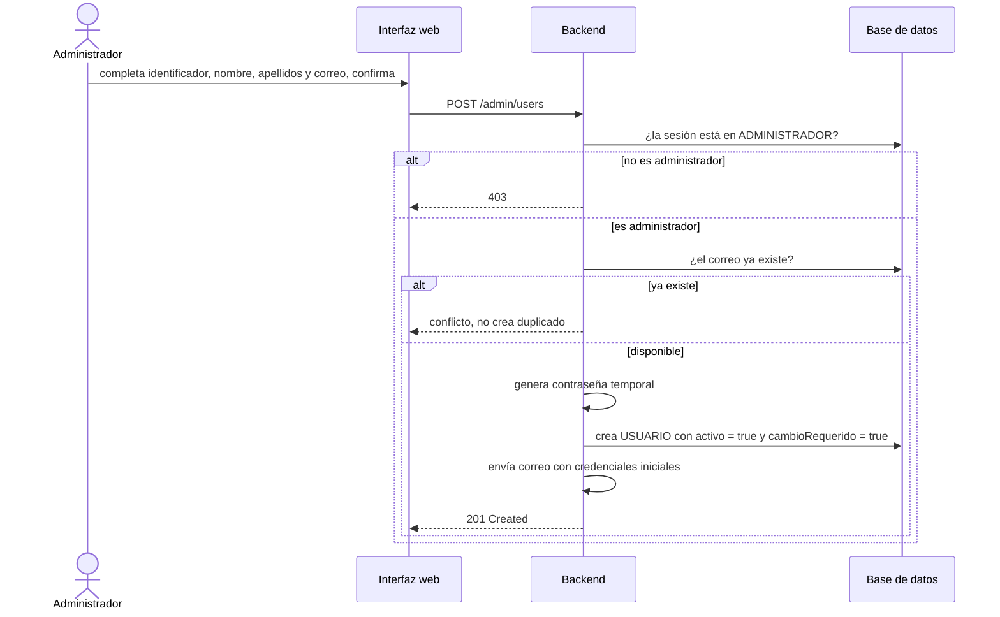
```mermaid
sequenceDiagram
  actor A as Administrador
  participant UI as Interfaz web
  participant API as Backend
  participant DB as Base de datos
  A->>UI: completa identificador, nombre, apellidos y correo, confirma
  UI->>API: POST /admin/users
  API->>DB: ¿la sesión está en ADMINISTRADOR?
  alt no es administrador
    API-->>UI: 403
  else es administrador
    API->>DB: ¿el correo ya existe?
    alt ya existe
      API-->>UI: conflicto, no crea duplicado
    else disponible
      API->>API: genera contraseña temporal
      API->>DB: crea USUARIO con activo = true y cambioRequerido = true
      API->>API: envía correo con credenciales iniciales
      API-->>UI: 201 Created
    end
  end
```

## 11. Decisiones abiertas y resueltas

1. ~~Cierre de sesión~~ **Resuelto (usuario, 3-oct-2026).** El sistema no maneja datos
   sensibles y un investigador puede trabajar mucho tiempo seguido, así que **no se usan
   tokens de vida corta**. El JWT dura mucho y es configurable (variable
   `JWT_EXPIRES_HOURS`, valor por defecto 168 h, una semana). "Cerrar sesión" borra el
   token en el navegador. **No se agrega ninguna tabla ni lista de bloqueo.**
2. ~~Envío de correo~~ **Resuelto (usuario, 4-oct-2026, D-45).** El sistema **sí envía
   correos**, desde una **cuenta de correo normal** (por ejemplo, Gmail con contraseña de
   aplicación); no depende de un servidor del IPN. Se configura con las variables `SMTP_*`
   (servidor, puerto, usuario, contraseña, remitente). Se envían:
   - **Notificaciones:** cada `NOTIFICACION` que el sistema crea (`analisis completado`,
     `error del pipeline`, `alerta de disco`, `video borrado`) se manda también por correo a su
     destinatario, como copia del aviso. La campanita no cambia. No se agregan tablas ni
     columnas: el correo sale de `USUARIO.correo`.
   - **Contraseña temporal:** al crear una cuenta se envía por correo **y** se muestra una
     sola vez en pantalla al administrador, como respaldo.
   - **Recuperación de contraseña:** el enlace firmado (`/auth/recover`) se envía por correo.

   Si el envío falla, la operación **no** se detiene: el aviso queda en la campanita y la
   contraseña temporal ya se mostró en pantalla. En desarrollo usa MailHog para ver los
   mensajes sin enviar nada. El correo de una cuenta puede ser de **cualquier dominio**
   (D-46). **[ABIERTO]** Qué otras notificaciones agregar: el usuario las definirá después;
   no implementes otras por tu cuenta.
3. ~~Quién crea las filas de `MODELO` y `CONFIGURACION`~~ **Sin objeto (usuario,
   5-oct-2026).** Las dos tablas y la columna `ANALISIS.idConfig` se eliminaron: ningún
   requisito permite cambiar el modelo ni el umbral. El modelo entrenado y el umbral de
   decisión (0.80) son constantes del worker (sección 4). Al encolar, el backend solo
   necesita el `idVideo`.
4. **Valor de `etapa` mientras el análisis está `en cola`: [PROPUESTA]** es nulo. Así
   está en el SQL del Anexo B. El usuario no lo ha confirmado.
5. **[ABIERTO] Tamaño máximo de video.** No está definido. Dejar el límite configurable
   (`MAX_UPLOAD_MB`).
6. ~~Cardinalidades de especímenes~~ **Resuelto** (sección 5): 2 a 4 por tanda, 2 o más
   por grupo, 1 o más tandas por grupo.
7. **[ABIERTO] Usuario administrador inicial:** hace falta una semilla en la base, porque
   no hay autoregistro. Pregunta al usuario qué nombre y correo usar.
8. ~~Conteo de conductas~~ **Resuelto (RF-18).** No hay duración mínima: cada segundo
   recibe una conducta y ninguna se descarta por durar poco. `INTERVALO` y `PRESENTA` no
   cambian: `PRESENTA` cuenta los segundos de cada conducta en cada minuto.
9. ~~"Último acceso" de cada usuario~~ **Resuelto (usuario, 3-oct-2026).** Se quita:
   la lista de administración no muestra último acceso y `USUARIO` no lleva esa columna.
10. **[ABIERTO] Log de ejecución del análisis.** Se quería un registro expandible en la
    pantalla de progreso, pero ninguna tabla guarda mensajes del worker. Por ahora la
    interfaz solo muestra la etapa actual. Lo mismo aplica a un código de error: se arma
    a partir de `etapa`.
11. ~~Quién puede eliminar un experimento~~ **Resuelto (usuario, 3-oct-2026).** Solo quien
    lo creó o un administrador; cualquier otro investigador recibe 403. Se rechaza con 409
    si algún análisis del experimento está `procesando` (esta parte sigue como propuesta).
12. ~~De dónde sale el identificador institucional de una cuenta nueva~~ **Resuelto
    (usuario, 3-oct-2026).** El administrador lo escribe en el formulario de crear cuenta,
    junto con nombre, apellidos y correo. La contraseña temporal la genera el sistema
    (corregido por el usuario, 4-oct-2026). El backend rechaza el alta si el
    identificador o el correo ya existen.
13. ~~Qué pasa con `VIDEO.archivo` cuando el video se borra~~ **Resuelto (usuario,
    5-oct-2026).** `VIDEO.archivo` admite nulo: al borrar el video, la tarea programada lo
    deja en nulo. Nulo significa "el video ya se borró"; la interfaz lo usa para saber que
    ya no se puede reproducir. La fila de `VIDEO` se conserva.
14. ~~Análisis en pantalla con intervención humana~~ **Resuelto para esta versión (usuario,
    3-oct-2026).** **No hay vista en vivo, ni procesamiento a la velocidad del video, ni
    intervención mientras corre el análisis.** El análisis corre en segundo plano a su
    propio ritmo (el algoritmo actual hace tres pasadas sobre el video completo, así que
    tarda más que el video; cada video de 5 min tarda unos 10 min). **Solo al final**, cuando
    el análisis termina, el usuario abre la pantalla de revisión segundo a segundo
    (sección 9.7) y puede corregir las etiquetas. Quedan **diferidas** y **no debes
    implementar**: la vista en tiempo real, detener el análisis cuando se pierde el tubo,
    y el recuadro manipulable.
15. ~~Significado de `ANALISIS.nivelClasif`~~ **Resuelto (usuario, 3-oct-2026).** Se
    queda. `agrupado` si algún segundo quedó como conducta activa; `preciso` si ninguno. La
    interfaz solo lo usa para avisar.
16. **Video para reproducir en el navegador. Resuelto (usuario, 3-oct-2026):** se queda
    la propuesta. Los `.mov` del iPhone suelen venir
    en un códec (HEVC) que Chrome y Firefox no reproducen. Al terminar el
    análisis, el worker genera con `ffmpeg` una copia en H.264 de los primeros 300 s
    (`analisis_{idAnalisis}_web.mp4`, en el volumen `videos_reportes`) y la pantalla de
    revisión reproduce esa copia. En `worker_fake`, simplemente copia o enlaza el original.
    Esa copia también se borra con el video a los 30 días.
17. **Dónde se guardan los recuadros de los tubos. Resuelto (usuario, 3-oct-2026):** se
    queda la propuesta. La pantalla de revisión
    dibuja un recuadro sobre el video para destacar el tubo del espécimen que se revisa.
    Esos datos no tienen tabla. El worker los escribe en un archivo del volumen
    (`analisis_{idAnalisis}_cajas.json`) y el backend lo entrega a la pantalla. No se
    cambia la base de datos por esto.
18. **[ABIERTO] Quién puede corregir y cómo cuenta.** **[PROPUESTA]** Quien creó el
    experimento o un administrador. Al guardar correcciones se recalculan los totales por
    minuto y los reportes se regeneran (ya lo hacen cuando hay datos nuevos). Los reportes
    indican si hubo revisión humana. El usuario no lo ha confirmado.

## 12. Orden de construcción sugerido [PROPUESTA]

Cada paso termina con algo que se puede probar.

1. **Docker Compose con `db` y `backend`** que arrancan (parte del Anexo C). Prueba:
   `docker compose up` y un endpoint de salud responde.
2. **Base de datos:** usa el SQL del Anexo B (dominios, 15 tablas, restricciones,
   disparador de `ESPECIMEN.idGrupo` y datos semilla de `CONDUCTA`). Falta el administrador
   inicial (sección 11, punto 7).
   Pruébalo contra un PostgreSQL real y corrige lo que falle.
3. **Autenticación:** login, logout, cambio de contraseña, cambio obligatorio en el primer
   ingreso, recuperación. Bcrypt. JWT de larga duración y configurable (sección 11,
   punto 1). Verificación de rol en `/admin/*`.
4. **Administración de usuarios** (crear, editar, desactivar, listar con filtros).
5. **Experimentos y carga de video:** crear experimento, sugerir tanda, subir `.mp4` o `.mov`,
   validar, guardar, crear el análisis en cola.
6. **`worker_fake`:** simula el contrato de la sección 4, con un caso exitoso y uno de
   error (por ejemplo, un archivo cuyo nombre contenga la palabra `falla`).
7. **Progreso y resultados:** endpoint de estado con porcentaje, resultados por espécimen,
   desglose por minuto, comparación Día 1 vs Día 2, comparación entre grupos.
8. **Reportes:** CSV, XLSX, PDF con regeneración por vigencia, y PDF de diagnóstico.
   **Revisión segundo a segundo:** las tres rutas de la sección 6, el recálculo de
   `PRESENTA` y la pantalla 9.7 (después de tener resultados y reportes funcionando).
9. **Tareas programadas:** borrado a 30 días, aviso a 7 días, vigilancia de disco.
10. **Frontend:** primero inicio de sesión y dashboard, luego crear experimento, progreso,
    resultados y administración.
11. **Pruebas:** 4 sesiones simultáneas con un análisis en cola sin pasar de 3 s; los tres
    navegadores; despliegue limpio con solo Docker en una segunda máquina.

### Criterios de aceptación mínimos
- `docker compose up` en una máquina limpia deja todo funcionando.
- Un administrador puede crear una cuenta y esa cuenta debe cambiar la contraseña al entrar.
- Subir un `.mp4` o `.mov` en horizontal crea un análisis `en cola`; el `worker_fake` lo lleva a `completado`
  y la pantalla de progreso lo refleja sin recargar.
- Subir un archivo que no es `.mp4` ni `.mov`, o un video en vertical, se rechaza en el
  cliente.
- Un investigador que no es administrador recibe 403 en `/admin/*` aunque conozca la URL.
- Un reporte vuelve a generarse cuando hay un análisis más nuevo que el guardado.
- No existe ningún botón para cancelar o reiniciar un análisis.


## 13. Anexo A: diagramas en código PlantUML

Cada bloque empieza con `@startuml nombre` y termina con `@enduml`. Guarda cada uno como
`nombre.puml` y genéralo con:

```
java -jar plantuml.jar -tpng -o salida nombre.puml
```

Los de casos de uso usan `!pragma layout smetana` y no necesitan Graphviz. Los demás sí
lo necesitan (o instala PlantUML con Graphviz incluido). Los diagramas marcados
**[PROPUESTA]** los redacta este documento a partir de las reglas de las secciones 4 a 8;
los demás describen el diseño ya acordado.

Índice:
- A.1 Arquitectura de software
- A.2 Despliegue con Docker [PROPUESTA]
- A.3 Módulos del backend [PROPUESTA]
- A.4 Esquema físico de la base de datos
- A.5 Diagrama de clases
- A.6 Estados del análisis y del experimento
- A.7 Casos de uso (visión general y 5 paquetes)
- A.8 Secuencias: autenticación y cuentas
- A.9 Secuencias: experimentos, carga, análisis y revisión segundo a segundo
- A.10 Secuencias: resultados, reportes y notificaciones
- A.11 Tareas programadas [PROPUESTA]

### A.1 Arquitectura de software

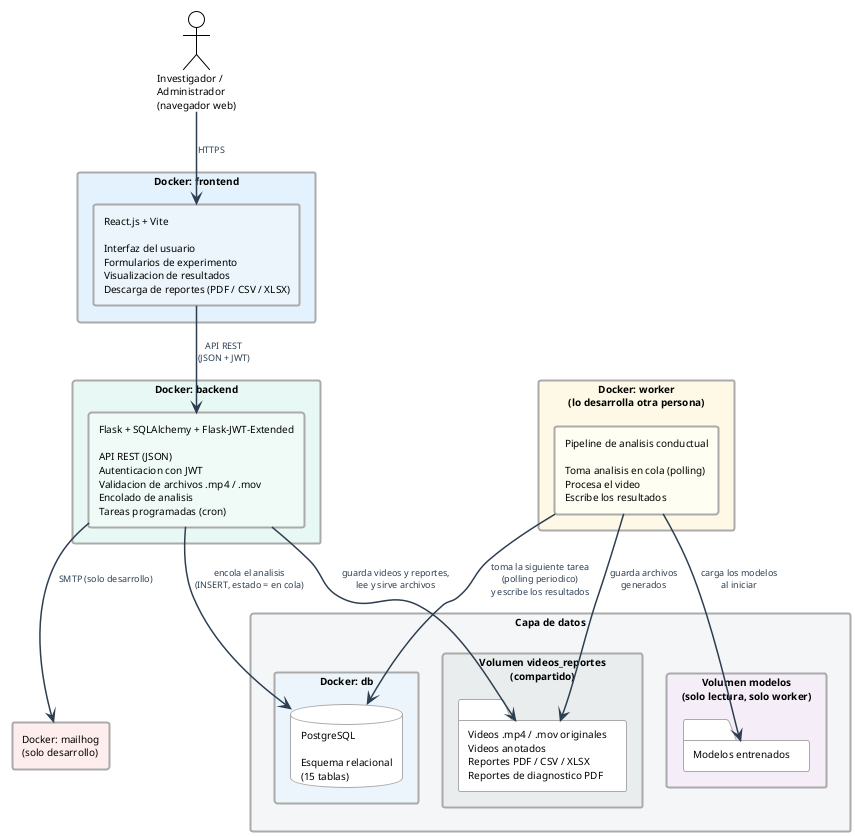
```plantuml
@startuml arquitectura_software
!theme plain
skinparam defaultFontName Arial
skinparam defaultFontSize 10
skinparam shadowing false
skinparam BackgroundColor White
skinparam ArrowColor      #2C3E50
skinparam ArrowThickness  1.5
skinparam ArrowFontSize   9
skinparam ArrowFontColor  #2C3E50
skinparam RectangleBorderThickness 2
skinparam RectangleBorderColor     #AAAAAA
skinparam DatabaseBorderColor      #AAAAAA
skinparam FolderBorderColor        #AAAAAA

top to bottom direction

actor "Investigador /\nAdministrador\n(navegador web)" as INV

rectangle "Docker: frontend" as C_FE #E3F2FD {
  rectangle "React.js + Vite\n\nInterfaz del usuario\nFormularios de experimento\nVisualizacion de resultados\nDescarga de reportes (PDF / CSV / XLSX)" as FE #EBF5FB
}

rectangle "Docker: backend" as C_BE #E8F8F5 {
  rectangle "Flask + SQLAlchemy + Flask-JWT-Extended\n\nAPI REST (JSON)\nAutenticacion con JWT\nValidacion de archivos .mp4 / .mov\nEncolado de analisis\nTareas programadas (cron)" as BE #F0FBF8
}

rectangle "Docker: worker\n(lo desarrolla otra persona)" as C_WK #FEF9E7 {
  rectangle "Pipeline de analisis conductual\n\nToma analisis en cola (polling)\nProcesa el video\nEscribe los resultados" as WK #FFFEF2
}

rectangle "Capa de datos" as DATOS #F4F6F7 {
  rectangle "Docker: db" as C_DB #EBF5FB {
    database "PostgreSQL\n\nEsquema relacional\n(15 tablas)" as DB
  }
  rectangle "Volumen videos_reportes\n(compartido)" as C_FS #EAEDED {
    folder "Videos .mp4 / .mov originales\nVideos anotados\nReportes PDF / CSV / XLSX\nReportes de diagnostico PDF" as FS
  }
  rectangle "Volumen modelos\n(solo lectura, solo worker)" as C_MD #F5EEF8 {
    folder "Modelos entrenados" as MD
  }
}

rectangle "Docker: mailhog\n(solo desarrollo)" as C_ML #FDEDEC

INV  -down->  FE  : "HTTPS"
FE   -down->  BE  : "API REST\n(JSON + JWT)"
BE   -down->  DB  : "encola el analisis\n(INSERT, estado = en cola)"
WK   -->      DB  : "toma la siguiente tarea\n(polling periodico)\ny escribe los resultados"
WK   -->      FS  : "guarda archivos\ngenerados"
BE   -->      FS  : "guarda videos y reportes,\nlee y sirve archivos"
WK   -->      MD  : "carga los modelos\nal iniciar"
BE   -->      C_ML : "SMTP (solo desarrollo)"
@enduml
```

### A.2 Despliegue con Docker [PROPUESTA]

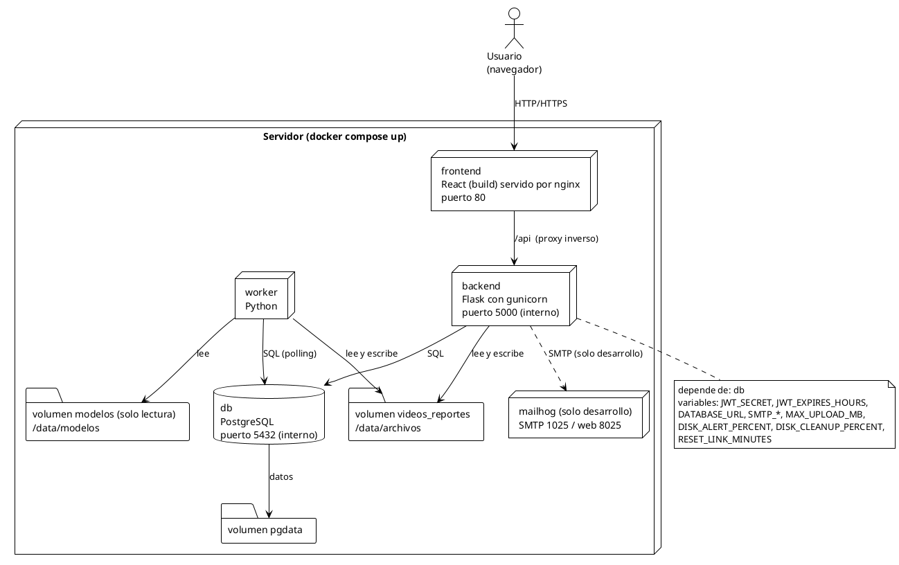
```plantuml
@startuml despliegue_docker
!theme plain
skinparam defaultFontName Arial
skinparam shadowing false
skinparam BackgroundColor White

actor "Usuario\n(navegador)" as U

node "Servidor (docker compose up)" {
  node "frontend\nReact (build) servido por nginx\npuerto 80" as fe
  node "backend\nFlask con gunicorn\npuerto 5000 (interno)" as be
  node "worker\nPython" as wk
  database "db\nPostgreSQL\npuerto 5432 (interno)" as db
  node "mailhog (solo desarrollo)\nSMTP 1025 / web 8025" as ml
  folder "volumen videos_reportes\n/data/archivos" as vf
  folder "volumen modelos (solo lectura)\n/data/modelos" as vm
  folder "volumen pgdata" as vp
}

U --> fe : HTTP/HTTPS
fe --> be : /api  (proxy inverso)
be --> db : SQL
wk --> db : SQL (polling)
be --> vf : lee y escribe
wk --> vf : lee y escribe
wk --> vm : lee
db --> vp : datos
be ..> ml : SMTP (solo desarrollo)

note bottom of be
  depende de: db
  variables: JWT_SECRET, JWT_EXPIRES_HOURS,
  DATABASE_URL, SMTP_*, MAX_UPLOAD_MB,
  DISK_ALERT_PERCENT, DISK_CLEANUP_PERCENT,
  RESET_LINK_MINUTES
end note
@enduml
```

### A.3 Módulos del backend [PROPUESTA]

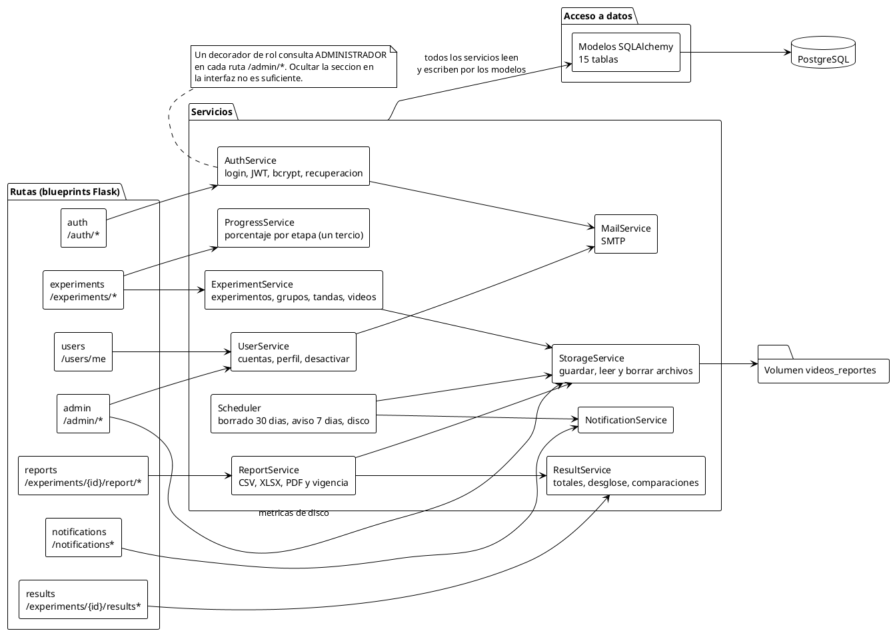
```plantuml
@startuml modulos_backend
!theme plain
skinparam defaultFontName Arial
skinparam shadowing false
skinparam componentStyle rectangle
left to right direction

package "Rutas (blueprints Flask)" {
  [auth\n/auth/*] as r_auth
  [users\n/users/me] as r_users
  [admin\n/admin/*] as r_admin
  [experiments\n/experiments/*] as r_exp
  [results\n/experiments/{id}/results*] as r_res
  [reports\n/experiments/{id}/report/*] as r_rep
  [notifications\n/notifications*] as r_not
}

package "Servicios" as SERV {
  [AuthService\nlogin, JWT, bcrypt, recuperacion] as s_auth
  [UserService\ncuentas, perfil, desactivar] as s_user
  [ExperimentService\nexperimentos, grupos, tandas, videos] as s_exp
  [StorageService\nguardar, leer y borrar archivos] as s_sto
  [ProgressService\nporcentaje por etapa (un tercio)] as s_prog
  [ResultService\ntotales, desglose, comparaciones] as s_res
  [ReportService\nCSV, XLSX, PDF y vigencia] as s_rep
  [NotificationService] as s_not
  [MailService\nSMTP] as s_mail
  [Scheduler\nborrado 30 dias, aviso 7 dias, disco] as s_sch
}

package "Acceso a datos" {
  [Modelos SQLAlchemy\n15 tablas] as m
}

database "PostgreSQL" as db
folder "Volumen videos_reportes" as fs

r_auth --> s_auth
r_users --> s_user
r_admin --> s_user
r_admin --> s_sto : metricas de disco
r_exp --> s_exp
r_exp --> s_prog
r_res --> s_res
r_rep --> s_rep
r_not --> s_not

s_auth --> s_mail
s_user --> s_mail
s_exp --> s_sto
s_rep --> s_res
s_rep --> s_sto
s_sch --> s_sto
s_sch --> s_not

SERV --> m : "todos los servicios leen\ny escriben por los modelos"
m --> db
s_sto --> fs

note bottom of s_auth
  Un decorador de rol consulta ADMINISTRADOR
  en cada ruta /admin/*. Ocultar la seccion en
  la interfaz no es suficiente.
end note
@enduml
```

### A.4 Esquema físico de la base de datos

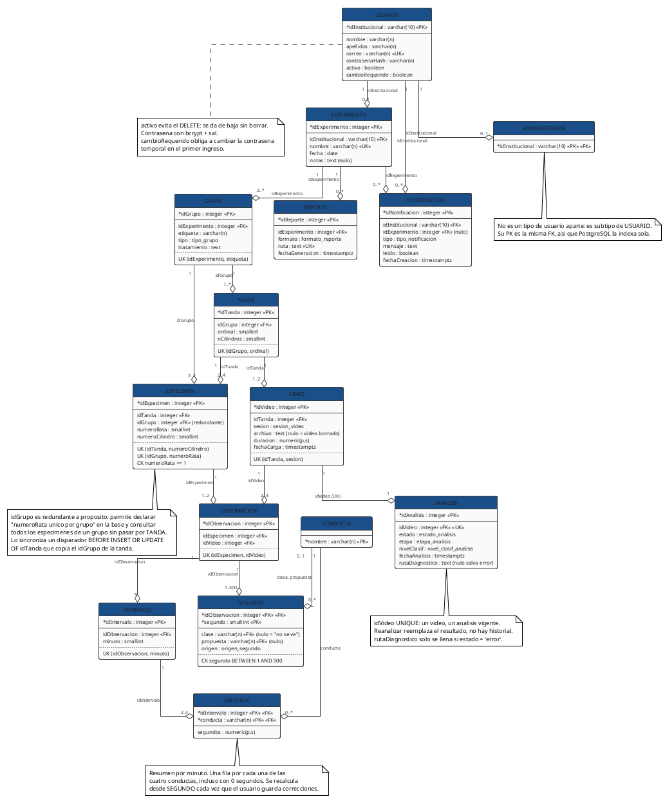
```plantuml
@startuml esquema_fisico
!theme plain
skinparam defaultFontName Arial
skinparam defaultFontSize 9
skinparam shadowing false
skinparam linetype ortho
skinparam classAttributeIconSize 0
skinparam BackgroundColor White
skinparam nodesep 34
skinparam ranksep 42

hide circle

skinparam class {
  BackgroundColor       #FAFAFA
  BorderColor           #3A3A3A
  BorderThickness       1
  HeaderBackgroundColor #1B4F8A
  HeaderFontColor       #FFFFFF
  HeaderFontSize        10
  HeaderFontStyle       bold
  AttributeFontSize     8
  AttributeFontColor    #1A1A1A
}

skinparam arrow {
  Color     #3A3A3A
  Thickness 1
  FontSize  7
  FontColor #3A3A3A
}

' Dominios cerrados (CREATE DOMAIN ... CHECK):
'   tipo_grupo             IN ('control','referencia','tratamiento experimental')
'   sesion_video           IN ('Dia 1','Dia 2')
'   formato_reporte        IN ('CSV','XLSX','PDF')
'   tipo_notificacion      IN ('analisis completado','error del pipeline','alerta de disco','video borrado')
'   estado_analisis        IN ('en cola','procesando','completado','error')
'   etapa_analisis         IN ('preprocesamiento','cilindros','clasificacion')
'   nivel_clasif_analisis  IN ('preciso','agrupado')
'   origen_segundo         IN ('maquina','humano_confirma','humano_corrige','humano_duda','sin_revisar','humano_ciego')
' Todas las llaves foraneas: ON UPDATE NO ACTION ON DELETE NO ACTION.

entity USUARIO {
  * idInstitucional : varchar(10) <<PK>>
  --
  nombre : varchar(n)
  apellidos : varchar(n)
  correo : varchar(n) <<UK>>
  contrasenaHash : varchar(n)
  activo : boolean
  cambioRequerido : boolean
}
note bottom of USUARIO
  activo evita el DELETE: se da de baja sin borrar.
  Contrasena con bcrypt + sal.
  cambioRequerido obliga a cambiar la contrasena
  temporal en el primer ingreso.
end note

entity EXPERIMENTO {
  * idExperimento : integer <<PK>>
  --
  idInstitucional : varchar(10) <<FK>>
  nombre : varchar(n) <<UK>>
  fecha : date
  notas : text (nulo)
}

entity GRUPO {
  * idGrupo : integer <<PK>>
  --
  idExperimento : integer <<FK>>
  etiqueta : varchar(n)
  tipo : tipo_grupo
  tratamiento : text
  ..
  UK (idExperimento, etiqueta)
}

entity TANDA {
  * idTanda : integer <<PK>>
  --
  idGrupo : integer <<FK>>
  ordinal : smallint
  nCilindros : smallint
  ..
  UK (idGrupo, ordinal)
}

entity ESPECIMEN {
  * idEspecimen : integer <<PK>>
  --
  idTanda : integer <<FK>>
  idGrupo : integer <<FK>> (redundante)
  numeroRata : smallint
  numeroCilindro : smallint
  ..
  UK (idTanda, numeroCilindro)
  UK (idGrupo, numeroRata)
  CK numeroRata >= 1
}
note bottom of ESPECIMEN
  idGrupo es redundante a proposito: permite declarar
  "numeroRata unico por grupo" en la base y consultar
  todos los especimenes de un grupo sin pasar por TANDA.
  Lo sincroniza un disparador BEFORE INSERT OR UPDATE
  OF idTanda que copia el idGrupo de la tanda.
end note

entity VIDEO {
  * idVideo : integer <<PK>>
  --
  idTanda : integer <<FK>>
  sesion : sesion_video
  archivo : text (nulo = video borrado)
  duracion : numeric(p,s)
  fechaCarga : timestamptz
  ..
  UK (idTanda, sesion)
}

entity ANALISIS {
  * idAnalisis : integer <<PK>>
  --
  idVideo : integer <<FK>> <<UK>>
  estado : estado_analisis
  etapa : etapa_analisis
  nivelClasif : nivel_clasif_analisis
  fechaAnalisis : timestamptz
  rutaDiagnostico : text (nulo salvo error)
}
note bottom of ANALISIS
  idVideo UNIQUE: un video, un analisis vigente.
  Reanalizar reemplaza el resultado, no hay historial.
  rutaDiagnostico solo se llena si estado = 'error'.
end note

entity OBSERVACION {
  * idObservacion : integer <<PK>>
  --
  idEspecimen : integer <<FK>>
  idVideo : integer <<FK>>
  ..
  UK (idEspecimen, idVideo)
}

entity INTERVALO {
  * idIntervalo : integer <<PK>>
  --
  idObservacion : integer <<FK>>
  minuto : smallint
  ..
  UK (idObservacion, minuto)
}

entity CONDUCTA {
  * nombre : varchar(n) <<PK>>
}

entity PRESENTA {
  * idIntervalo : integer <<PK>> <<FK>>
  * conducta : varchar(n) <<PK>> <<FK>>
  --
  segundos : numeric(p,s)
}
note bottom of PRESENTA
  Resumen por minuto. Una fila por cada una de las
  cuatro conductas, incluso con 0 segundos. Se recalcula
  desde SEGUNDO cada vez que el usuario guarda correcciones.
end note

entity SEGUNDO {
  * idObservacion : integer <<PK>> <<FK>>
  * segundo : smallint <<PK>>
  --
  clase : varchar(n) <<FK>> (nulo = "no se ve")
  propuesta : varchar(n) <<FK>> (nulo)
  origen : origen_segundo
  ..
  CK segundo BETWEEN 1 AND 300
}

entity ADMINISTRADOR {
  * idInstitucional : varchar(10) <<PK>> <<FK>>
}
note bottom of ADMINISTRADOR
  No es un tipo de usuario aparte: es subtipo de USUARIO.
  Su PK es la misma FK, asi que PostgreSQL la indexa sola.
end note

entity REPORTE {
  * idReporte : integer <<PK>>
  --
  idExperimento : integer <<FK>>
  formato : formato_reporte
  ruta : text <<UK>>
  fechaGeneracion : timestamptz
}

entity NOTIFICACION {
  * idNotificacion : integer <<PK>>
  --
  idInstitucional : varchar(10) <<FK>>
  idExperimento : integer <<FK>> (nulo)
  tipo : tipo_notificacion
  mensaje : text
  leido : boolean
  fechaCreacion : timestamptz
}

USUARIO        "1" --o "0..*" EXPERIMENTO              : idInstitucional
USUARIO        "1" --o "0..*" NOTIFICACION              : idInstitucional
USUARIO        "1" --o "0..1" ADMINISTRADOR             : idInstitucional

EXPERIMENTO    "1" --o "3..*" GRUPO                     : idExperimento
EXPERIMENTO    "1" --o "0..*" REPORTE                   : idExperimento
EXPERIMENTO    "1" --o "0..*" NOTIFICACION               : idExperimento

GRUPO          "1" --o "1..*" TANDA                     : idGrupo
GRUPO          "1" --o "2..*" ESPECIMEN                 : idGrupo

TANDA          "1" --o "2..4" ESPECIMEN                 : idTanda
TANDA          "1" --o "1..2" VIDEO                     : idTanda

VIDEO          "1" --o "1"    ANALISIS                  : idVideo (UK)
VIDEO          "1" --o "2..4" OBSERVACION                : idVideo

ESPECIMEN      "1" --o "1..2" OBSERVACION                : idEspecimen

OBSERVACION    "1" --o "5"    INTERVALO                 : idObservacion
INTERVALO      "1" --o "2..4" PRESENTA                  : idIntervalo
CONDUCTA       "1" --o "0..*" PRESENTA                  : conducta
OBSERVACION    "1" --o "1..300" SEGUNDO                 : idObservacion
CONDUCTA       "0..1" --o "0..*" SEGUNDO                : clase, propuesta
@enduml
```

### A.5 Diagrama de clases

El paquete P3 (worker y pipeline) lo desarrolla otra persona; se incluye para ver cómo se
relaciona con el resto. El backend implementa los paquetes P1, P2, P4 y P5.

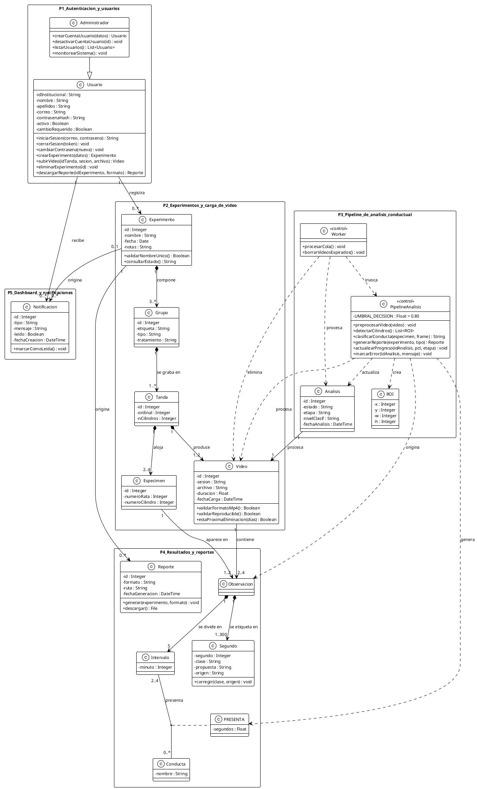
```plantuml
@startuml clases
!theme plain
skinparam defaultFontName Arial
skinparam defaultFontSize 11
skinparam shadowing false
skinparam classAttributeIconSize 0
skinparam packageStyle rectangle
skinparam nodesep 45
skinparam ranksep 55

package P1_Autenticacion_y_usuarios {
  class Usuario {
    -idInstitucional : String
    -nombre : String
    -apellidos : String
    -correo : String
    -contrasenaHash : String
    -activo : Boolean
    -cambioRequerido : Boolean
    +iniciarSesion(correo, contrasena) : String
    +cerrarSesion(token) : void
    +cambiarContrasena(nueva) : void
    +crearExperimento(datos) : Experimento
    +subirVideo(idTanda, sesion, archivo) : Video
    +eliminarExperimento(id) : void
    +descargarReporte(idExperimento, formato) : Reporte
  }
  class Administrador {
    +crearCuentaUsuario(datos) : Usuario
    +desactivarCuentaUsuario(id) : void
    +listarUsuarios() : List<Usuario>
    +monitorearSistema() : void
  }
}

package P2_Experimentos_y_carga_de_video {
  class Experimento {
    -id : Integer
    -nombre : String
    -fecha : Date
    -notas : String
    +validarNombreUnico() : Boolean
    +consultarEstado() : String
  }
  class Grupo {
    -id : Integer
    -etiqueta : String
    -tipo : String
    -tratamiento : String
  }
  class Tanda {
    -id : Integer
    -ordinal : Integer
    -nCilindros : Integer
  }
  class Especimen {
    -id : Integer
    -numeroRata : Integer
    -numeroCilindro : Integer
  }
  class Video {
    -id : Integer
    -sesion : String
    -archivo : String
    -duracion : Float
    -fechaCarga : DateTime
    +validarFormatoMp4() : Boolean
    +validarReproducible() : Boolean
    +estaProximaEliminacion(dias) : Boolean
  }
}

package P3_Pipeline_de_analisis_conductual {
  class Worker <<control>> {
    +procesarCola() : void
    +borrarVideosExpirados() : void
  }
  class PipelineAnalisis <<control>> {
    -UMBRAL_DECISION : Float = 0.80
    +preprocesarVideo(video) : void
    +detectarCilindros() : List<ROI>
    +clasificarConducta(especimen, frame) : String
    +generarReporte(experimento, tipo) : Reporte
    +actualizarProgreso(idAnalisis, pct, etapa) : void
    +marcarError(idAnalisis, mensaje) : void
  }
  class ROI {
    -x : Integer
    -y : Integer
    -w : Integer
    -h : Integer
  }
  class Analisis {
    -id : Integer
    -estado : String
    -etapa : String
    -nivelClasif : String
    -fechaAnalisis : DateTime
  }
}

package P4_Resultados_y_reportes {
  class Observacion {
  }
  class Intervalo {
    -minuto : Integer
  }
  class Conducta {
    -nombre : String
  }
  class PRESENTA {
    -segundos : Float
  }
  class Segundo {
    -segundo : Integer
    -clase : String
    -propuesta : String
    -origen : String
    +corregir(clase, origen) : void
  }
  class Reporte {
    -id : Integer
    -formato : String
    -ruta : String
    -fechaGeneracion : DateTime
    +generar(experimento, formato) : void
    +descargar() : File
  }
}

package P5_Dashboard_y_notificaciones {
  class Notificacion {
    -id : Integer
    -tipo : String
    -mensaje : String
    -leido : Boolean
    -fechaCreacion : DateTime
    +marcarComoLeida() : void
  }
}

Administrador --|> Usuario
Usuario "1" --> "0..*" Experimento  : registra
Usuario "1" --> "0..*" Notificacion : recibe

Experimento "1" *--> "3..*" Grupo     : compone
Grupo       "1" *--> "1..*" Tanda     : "se graba en"
Tanda       "1" *--> "2..4" Especimen : aloja
Tanda       "1" *--> "1..2" Video     : produce

Analisis "1" --> "1" Video            : procesa

Worker ..> PipelineAnalisis : invoca
Worker ..> Analisis         : procesa
Worker ..> Video            : elimina
PipelineAnalisis ..> ROI         : crea
PipelineAnalisis ..> Video       : procesa
PipelineAnalisis ..> Analisis    : actualiza
PipelineAnalisis ..> Observacion : origina
PipelineAnalisis ..> PRESENTA    : genera

Especimen   "1" --> "1..2" Observacion : "aparece en"
Video       "1" --> "2..4" Observacion : contiene
Observacion "1" *--> "5"   Intervalo   : "se divide en"
Observacion "1" *--> "1..300" Segundo  : "se etiqueta en"
Intervalo "2..4" -- "0..*" Conducta : presenta
(Intervalo, Conducta) .. PRESENTA

Experimento "1"    --> "0..*" Reporte      : origina
Experimento "0..1" --> "0..*" Notificacion : origina
@enduml
```

### A.6 Estados del análisis y del experimento

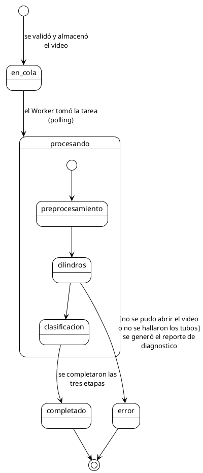
```plantuml
@startuml estados_analisis
!theme plain
skinparam defaultFontName Arial
skinparam shadowing false
[*] --> en_cola : se validó y almacenó\nel video
state procesando {
  [*] --> preprocesamiento
  preprocesamiento --> cilindros
  cilindros --> clasificacion
}
en_cola --> procesando : el Worker tomó la tarea\n(polling)
cilindros --> error : [no se pudo abrir el video\no no se hallaron los tubos]\nse generó el reporte de\ndiagnostico
clasificacion --> completado : se completaron las\ntres etapas
completado --> [*]
error --> [*]
@enduml
```

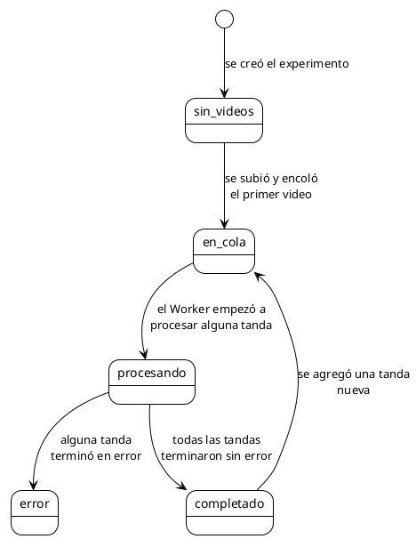
```plantuml
@startuml estados_experimento
!theme plain
skinparam defaultFontName Arial
skinparam shadowing false
' El estado del experimento NO se guarda: se calcula a partir de los
' analisis de todas sus tandas. Precedencia: error > procesando > en cola > completado.
[*] --> sin_videos : se creó el experimento
sin_videos --> en_cola : se subió y encoló\nel primer video
en_cola --> procesando : el Worker empezó a\nprocesar alguna tanda
procesando --> completado : todas las tandas\nterminaron sin error
procesando --> error : alguna tanda\nterminó en error
completado --> en_cola : se agregó una tanda\nnueva
@enduml
```

### A.7 Casos de uso

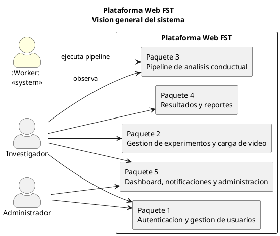
```plantuml
@startuml cu_vision_general
!pragma layout smetana
title Plataforma Web FST\nVision general del sistema
left to right direction
skinparam packageStyle rectangle
skinparam actorStyle awesome
skinparam usecase {
  BackgroundColor White
  BorderColor DarkSlateGray
}
actor "Investigador" as INV
actor "Administrador" as ADMIN
actor ":Worker:\n<<system>>" as WRK #LightYellow
rectangle "Plataforma Web FST" {
  rectangle "Paquete 1\nAutenticacion y gestion de usuarios" as P1
  rectangle "Paquete 2\nGestion de experimentos y carga de video" as P2
  rectangle "Paquete 3\nPipeline de analisis conductual" as P3
  rectangle "Paquete 4\nResultados y reportes" as P4
  rectangle "Paquete 5\nDashboard, notificaciones y administracion" as P5
}
INV --> P1
INV --> P2
INV --> P3 : observa
INV --> P4
INV --> P5
ADMIN --> P1
ADMIN --> P5
WRK --> P3 : ejecuta pipeline
@enduml
```

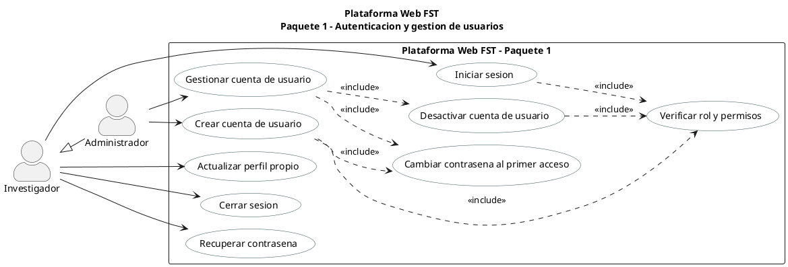
```plantuml
@startuml cu_paquete1
!pragma layout smetana
title Plataforma Web FST\nPaquete 1 - Autenticacion y gestion de usuarios
left to right direction
skinparam packageStyle rectangle
skinparam actorStyle awesome
skinparam usecase {
  BackgroundColor White
  BorderColor DarkSlateGray
}
actor "Investigador" as INV
actor "Administrador" as ADMIN
INV <|-- ADMIN
rectangle "Plataforma Web FST - Paquete 1" {
  usecase "Iniciar sesion" as UC11
  usecase "Cerrar sesion" as UC12
  usecase "Recuperar contrasena" as UC13
  usecase "Verificar rol y permisos" as UC14
  usecase "Gestionar cuenta de usuario" as UC15
  usecase "Cambiar contrasena al primer acceso" as UC15a
  usecase "Desactivar cuenta de usuario" as UC15b
  usecase "Actualizar perfil propio" as UC16
  usecase "Crear cuenta de usuario" as UC17
}
INV --> UC11
INV --> UC12
INV --> UC13
INV --> UC16
ADMIN --> UC15
ADMIN --> UC17
UC17 ..> UC14 : <<include>>
UC15b ..> UC14 : <<include>>
UC11 ..> UC14 : <<include>>
UC15 ..> UC15a : <<include>>
UC15 ..> UC15b : <<include>>
UC17 ..> UC15a : <<include>>
@enduml
```

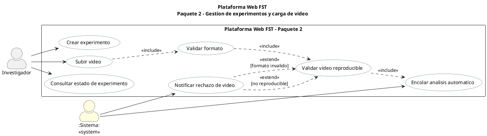
```plantuml
@startuml cu_paquete2
!pragma layout smetana
title Plataforma Web FST\nPaquete 2 - Gestion de experimentos y carga de video
left to right direction
skinparam packageStyle rectangle
skinparam actorStyle awesome
skinparam usecase {
  BackgroundColor White
  BorderColor DarkSlateGray
}
actor "Investigador" as INV
actor ":Sistema:\n<<system>>" as SYS #LightYellow
rectangle "Plataforma Web FST - Paquete 2" {
  usecase "Crear experimento" as UC21
  usecase "Subir video" as UC22
  usecase "Validar formato" as UC23
  usecase "Validar video reproducible" as UC24
  usecase "Encolar analisis automatico" as UC25
  usecase "Notificar rechazo de video" as UC26
  usecase "Consultar estado de experimento" as UC27
}
INV --> UC21
INV --> UC22
INV --> UC27
SYS --> UC25
SYS --> UC26
UC22 ..> UC23 : <<include>>
UC23 ..> UC24 : <<include>>
UC24 ..> UC25 : <<include>>
UC26 ..> UC24 : <<extend>>\n[no reproducible]
UC26 ..> UC24 : <<extend>>\n[formato invalido]
@enduml
```

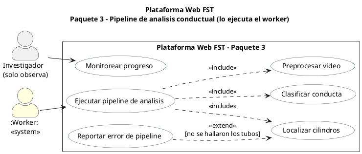
```plantuml
@startuml cu_paquete3
!pragma layout smetana
title Plataforma Web FST\nPaquete 3 - Pipeline de analisis conductual (lo ejecuta el worker)
left to right direction
skinparam packageStyle rectangle
skinparam actorStyle awesome
skinparam usecase {
  BackgroundColor White
  BorderColor DarkSlateGray
}
actor "Investigador\n(solo observa)" as INV
actor ":Worker:\n<<system>>" as WRK #LightYellow
rectangle "Plataforma Web FST - Paquete 3" {
  usecase "Ejecutar pipeline de analisis" as UC30
  usecase "Preprocesar video" as UC31
  usecase "Localizar cilindros" as UC32
  usecase "Clasificar conducta" as UC34
  usecase "Monitorear progreso" as UC35
  usecase "Reportar error de pipeline" as UC36
}
WRK --> UC30
INV --> UC35
UC30 ..> UC31 : <<include>>
UC30 ..> UC32 : <<include>>
UC30 ..> UC34 : <<include>>
UC36 ..> UC32 : <<extend>>\n[no se hallaron los tubos]
@enduml
```

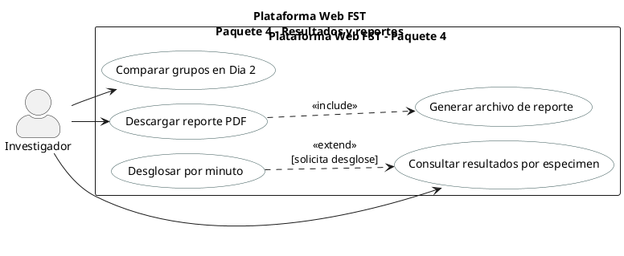
```plantuml
@startuml cu_paquete4
!pragma layout smetana
title Plataforma Web FST\nPaquete 4 - Resultados y reportes
left to right direction
skinparam packageStyle rectangle
skinparam actorStyle awesome
skinparam usecase {
  BackgroundColor White
  BorderColor DarkSlateGray
}
actor "Investigador" as INV
rectangle "Plataforma Web FST - Paquete 4" {
  usecase "Consultar resultados por especimen" as UC41
  usecase "Desglosar por minuto" as UC42
  usecase "Comparar grupos en Dia 2" as UC43
  usecase "Descargar reporte PDF" as UC45
  usecase "Generar archivo de reporte" as UC46
}
INV --> UC41
INV --> UC43
INV --> UC45
UC42 ..> UC41 : <<extend>>\n[solicita desglose]
UC45 ..> UC46 : <<include>>
@enduml
```

```plantuml
@startuml cu_paquete5
!pragma layout smetana
title Plataforma Web FST\nPaquete 5 - Dashboard, notificaciones y administracion
left to right direction
skinparam packageStyle rectangle
skinparam actorStyle awesome
skinparam usecase {
  BackgroundColor White
  BorderColor DarkSlateGray
}
actor "Investigador" as INV
actor "Administrador" as ADMIN
actor ":Worker:\n<<system>>" as WRK #LightYellow
actor ":Sistema:\n<<system>>" as SYS #LightYellow
rectangle "Plataforma Web FST - Paquete 5" {
  usecase "Consultar dashboard" as UC51
  usecase "Filtrar experimentos" as UC51a
  usecase "Avisar expiracion de video" as UC52
  usecase "Eliminar experimento" as UC53
  usecase "Confirmar eliminacion" as UC53a
  usecase "Borrar video automaticamente" as UC54
  usecase "Conservar resultados y reportes" as UC55
  usecase "Listar usuarios" as UC56
  usecase "Monitorear estado del sistema" as UC57
  usecase "Notificar uso de disco" as UC57a
  usecase "Gestionar experimentos globales" as UC58
}
INV --> UC51
INV --> UC53
ADMIN --> UC56
ADMIN --> UC57
ADMIN --> UC58
WRK --> UC54
SYS --> UC52
UC52 ..> UC51 : <<extend>>\n[video expira en < 7 dias]
UC51a ..> UC51 : <<extend>>\n[aplica filtro]
UC57a ..> UC57 : <<extend>>\n[disco > 80%]
UC53 ..> UC53a : <<include>>
UC54 ..> UC55 : <<include>>
@enduml
```

Nota: en estos diagramas el borrado automático de videos (UC54) aparece asignado al
Worker. En la implementación que se describe en este documento lo hace una **tarea
programada del backend** (sección 8 y A.11).

### A.8 Secuencias: autenticación y cuentas

```plantuml
@startuml seq_login
!theme plain
skinparam defaultFontName Arial
skinparam defaultFontSize 11
skinparam shadowing false
skinparam sequenceMessageAlign center
actor Usuario as u
participant "Interfaz web" as ui
participant Backend as api
database "Base de datos" as db

u -> ui: escribe correo y contraseña
ui -> api: POST /auth/login {correo, contraseña}
api -> db: busca el USUARIO por correo
db --> api: usuario, o nada
alt no existe, está inactivo (activo = false)\no la contraseña no coincide (bcrypt)
  api --> ui: 401 con mensaje genérico\n"Credenciales incorrectas"
  ui --> u: muestra el error, sin decir qué campo falló
else credenciales válidas
  api -> db: ¿el idInstitucional está en ADMINISTRADOR?
  db --> api: sí / no
  api -> api: genera el JWT con idInstitucional, rol\ny vencimiento (JWT_EXPIRES_HOURS)
  api --> ui: 200 OK {token, rol, cambioRequerido}
  alt cambioRequerido = true
    ui --> u: obliga a cambiar la contraseña\nantes de continuar
  else cambioRequerido = false
    ui --> u: abre el dashboard
  end
end
@enduml
```

```plantuml
@startuml seq_logout
!theme plain
skinparam defaultFontName Arial
skinparam defaultFontSize 11
skinparam shadowing false
skinparam sequenceMessageAlign center
actor Usuario as u
participant "Interfaz web" as ui
participant Backend as api

u -> ui: elige "Cerrar sesión"
ui -> api: POST /auth/logout
api --> ui: 200 OK\n(no guarda nada: no hay lista de bloqueo)
ui -> ui: borra el token del navegador
ui --> u: muestra la pantalla de inicio de sesión
@enduml
```

```plantuml
@startuml seq_cambiar_contrasena
!theme plain
skinparam defaultFontName Arial
skinparam defaultFontSize 11
skinparam shadowing false
skinparam sequenceMessageAlign center
actor Usuario as u
participant "Interfaz web" as ui
participant Backend as api
database "Base de datos" as db

note over u, ui
  Aplica tanto al cambio obligatorio del primer
  ingreso (cambioRequerido = true) como al
  cambio voluntario desde el perfil.
end note
u -> ui: escribe la contraseña actual\ny la nueva (dos veces)
ui -> api: PATCH /auth/password {actual, nueva}\ncon el JWT del usuario
api -> db: lee contrasenaHash del usuario
db --> api: hash actual
alt la contraseña actual no coincide
  api --> ui: 400, "La contraseña actual no es correcta"
else coincide
  alt la nueva es igual a la actual
    api --> ui: 400, "Elige una contraseña distinta"
  else es distinta
    api -> api: calcula el hash nuevo (bcrypt con sal)
    api -> db: actualiza contrasenaHash y\npone cambioRequerido = false
    db --> api: confirma
    api --> ui: 200 OK
    ui --> u: confirma el cambio y continúa al dashboard
  end
end
@enduml
```

```plantuml
@startuml seq_recuperar_contrasena
!theme plain
skinparam defaultFontName Arial
skinparam defaultFontSize 11
skinparam shadowing false
skinparam sequenceMessageAlign center
actor Usuario as u
participant "Interfaz web" as ui
participant Backend as api
database "Base de datos" as db

u -> ui: elige "Recuperar contraseña" y escribe su correo
ui -> api: POST /auth/recover {correo}
api -> db: ¿existe un USUARIO activo con ese correo?
db --> api: sí / no
opt existe
  api -> api: firma un enlace (JWT) con el idInstitucional\ny un vencimiento (RESET_LINK_MINUTES)
  api -> api: envía el correo con el enlace
end
api --> ui: 200 OK, siempre la misma respuesta\n(exista o no el correo)
ui --> u: "Si el correo está registrado,\nrecibirás un enlace"

u -> ui: abre el enlace y escribe la contraseña nueva
ui -> api: POST /auth/reset {token, nueva}
api -> api: verifica firma y vencimiento del enlace
alt enlace inválido o vencido
  api --> ui: 400, "El enlace no es válido o venció"
else enlace válido
  api -> db: actualiza contrasenaHash (bcrypt con sal)\ny pone cambioRequerido = false
  db --> api: confirma
  api --> ui: 200 OK
  ui --> u: "Contraseña actualizada", va al inicio de sesión
end
@enduml
```

```plantuml
@startuml seq_crear_cuenta
!theme plain
skinparam defaultFontName Arial
skinparam defaultFontSize 11
skinparam shadowing false
skinparam sequenceMessageAlign center
actor Administrador as admin
participant "Interfaz web" as ui
participant Backend as api
database "Base de datos" as db

admin -> ui: entra al panel de administración
note right of ui
  La sección de administración solo aparece si
  el usuario es Administrador. Ocultarla en la
  interfaz no evita por sí sola el siguiente paso.
end note
admin -> ui: selecciona "Crear cuenta"
ui -> admin: muestra el formulario\n(identificador institucional, nombre, apellidos, correo electrónico)
admin -> ui: completa los datos y confirma
ui -> api: POST /admin/users {idInstitucional, nombre, apellidos, correo}\ncon la sesión activa del Administrador
api -> db: ¿el idInstitucional de la sesión está en ADMINISTRADOR?
db --> api: sí / no
alt no está en ADMINISTRADOR
  api --> ui: 403, no autorizado
  ui --> admin: muestra el error, no crea la cuenta
else sí está en ADMINISTRADOR
  api -> db: ¿el correo ya está registrado?
  db --> api: sí / no
  alt el correo ya está registrado
    api --> ui: 409, conflicto
    ui --> admin: muestra el error, no crea el duplicado
  else el correo está disponible
    api -> api: genera la contraseña temporal
    api -> db: crea USUARIO\n(nombre, apellidos, correo, contrasenaHash,\nactivo = true, cambioRequerido = true)
    db --> api: confirma la creación
    api -> api: envía correo al nuevo usuario\ncon sus credenciales de acceso inicial
    api --> ui: 201 Created
    ui --> admin: confirma la cuenta creada
  end
end
@enduml
```

```plantuml
@startuml seq_gestion_usuarios
!theme plain
skinparam defaultFontName Arial
skinparam defaultFontSize 11
skinparam shadowing false
skinparam sequenceMessageAlign center
skinparam BoxPadding 10
actor Administrador as admin
participant "Interfaz web" as ui
participant Backend as api
database "Base de datos" as db

admin -> ui: abre el panel de usuarios
ui -> api: GET /admin/users\ncon la sesión activa del Administrador
api -> db: ¿el idInstitucional de la sesión está en ADMINISTRADOR?
db --> api: sí / no
alt no está en ADMINISTRADOR
  api --> ui: 403, no autorizado
  ui --> admin: muestra el error, no abre el panel
else sí está en ADMINISTRADOR
  api -> db: consulta los usuarios (nombre, correo, activo)
  db --> api: lista de usuarios
  api -> db: consulta cuáles de esos usuarios tienen fila en ADMINISTRADOR
  db --> api: lista de idInstitucional con permisos de administrador
  api -> api: combina ambas listas\n(marca en cada fila si es Administrador)
  api --> ui: 200 OK {usuarios, con marca de administrador}
  ui --> admin: muestra la tabla de usuarios
  admin -> ui: elige la acción sobre un usuario
  alt crear cuenta nueva
    ui --> admin: abre el formulario de "Crear cuenta"\n(ver seq_crear_cuenta)
  else editar o desactivar cuenta
    admin -> ui: cambia datos, o selecciona un usuario\ny confirma la desactivación
    ui -> api: PATCH /admin/users/{id} {datos, o activo: false}
    api -> db: si este usuario es Administrador y se desactiva,\n¿cuántos Administradores activos quedarían?
    db --> api: cantidad restante (o "no aplica")
    alt quedarían 0 Administradores activos
      api --> ui: rechaza la desactivación
      ui --> admin: muestra la advertencia\n"debe existir al menos un Administrador activo"
    else se puede aplicar el cambio
      api -> db: actualiza USUARIO (activo = false si se desactiva)
      db --> api: confirma la actualización
      api --> ui: 200 OK
      ui --> admin: la tabla refleja el cambio
    end
  end
end
@enduml
```

```plantuml
@startuml seq_perfil
!theme plain
skinparam defaultFontName Arial
skinparam defaultFontSize 11
skinparam shadowing false
skinparam sequenceMessageAlign center
actor Usuario as u
participant "Interfaz web" as ui
participant Backend as api
database "Base de datos" as db

u -> ui: abre su perfil y cambia nombre, apellidos o correo
ui -> api: PATCH /users/me {nombre, apellidos, correo}\ncon el JWT del usuario
alt el correo nuevo no tiene un formato válido
  api --> ui: 400, "Escribe un correo válido"
else el correo es válido
  api -> db: ¿otro usuario ya usa ese correo?
  db --> api: sí / no
  alt ya lo usa otro usuario
    api --> ui: 409, conflicto
  else está libre
    api -> db: actualiza nombre, apellidos y correo\ndel idInstitucional del token
    db --> api: confirma
    api --> ui: 200 OK {datos actualizados}
    ui --> u: muestra el perfil actualizado
  end
end
note over u, ui
  El cambio de contraseña se hace aparte
  (ver seq_cambiar_contrasena).
end note
@enduml
```

### A.9 Secuencias: experimentos, carga y análisis

```plantuml
@startuml seq_crear_experimento
!theme plain
skinparam defaultFontName Arial
skinparam defaultFontSize 11
skinparam shadowing false
skinparam sequenceMessageAlign center
actor Investigador as inv
participant "Interfaz web" as ui
participant Backend as api
database "Base de datos" as db

inv -> ui: escribe nombre, fecha y notas (opcional)
ui -> api: POST /experiments {nombre, fecha, notas}\ncon el JWT del usuario
api -> db: ¿ya existe un experimento con ese nombre?
db --> api: sí / no
alt el nombre ya existe
  api --> ui: 409, "Ya existe un experimento con ese nombre"
  ui --> inv: marca el campo nombre con el error
else el nombre es único
  api -> db: crea EXPERIMENTO con el idInstitucional del token
  db --> api: idExperimento
  api --> ui: 201 Created {idExperimento}
  ui --> inv: pasa al paso 2 (grupo, tanda y video)
end
@enduml
```

```plantuml
@startuml seq_carga_video
!theme plain
skinparam defaultFontName Arial
skinparam defaultFontSize 11
skinparam shadowing false
skinparam sequenceMessageAlign center
skinparam BoxPadding 10
actor Investigador as inv
participant "Interfaz web" as ui
participant Backend as api
database "Base de datos" as db

inv -> ui: selecciona el experimento activo
inv -> ui: escribe el nombre del grupo o tratamiento

ui -> api: GET /experiments/{id}/groups?q=
api -> db: consulta los grupos de este experimento
db --> api: grupos con nombre parecido, si existen
api --> ui: sugerencias para autocompletar

alt el nombre coincide con un grupo de este mismo experimento
  inv -> ui: selecciona la sugerencia
  api -> db: cuenta las tandas ya registradas del grupo
  db --> api: siguiente tanda disponible (por ejemplo, la B)
  api --> ui: precarga la tanda sugerida en un campo editable
  ui -> inv: pide confirmar\n"¿esta es la tanda B de [grupo]?"
  inv -> ui: confirma la tanda, o la corrige a mano
else no hay ningun grupo con ese nombre en este experimento
  ui -> inv: pide los datos del grupo nuevo\n(tipo, tratamiento)
  inv -> ui: captura el grupo nuevo
  note right of ui
    la primera tanda de un
    grupo nuevo siempre es "A"
  end note
end

inv -> ui: elige la sesion (Día 1 o Día 2),\nlos especímenes de la tanda (2 a 4)\ny selecciona el archivo .mp4 o .mov
ui -> api: POST /experiments/{id}/groups/{grupo}/videos\n(envía el video)

api -> api: valida formato y reproducibilidad del archivo

alt el archivo no es válido
  api --> ui: reporta el error de validación
  ui --> inv: muestra el mensaje, no avanza
else el archivo es válido
  api -> api: guarda el archivo en el volumen compartido
  api -> db: guarda el grupo, si es nuevo
  api -> db: guarda la tanda, nueva o existente
  api -> db: guarda el video, con su tanda y su sesión
  api -> db: crea el análisis del video, con estado "en cola"
  db --> api: confirma que todo quedó guardado
  api --> ui: 201, video almacenado, análisis en cola
  ui --> inv: confirmación, y redirección a la pantalla de progreso
end
@enduml
```

```plantuml
@startuml seq_analisis_automatico
!theme plain
skinparam defaultFontName Arial
skinparam defaultFontSize 11
skinparam shadowing false
skinparam sequenceMessageAlign center
skinparam BoxPadding 10
participant Worker as w
participant "Archivos" as fs
database "Base de datos" as db

note over w, db
  Esto lo hace el worker (lo desarrolla otra persona).
  Aqui sirve como contrato: tu worker_fake debe
  escribir en la base exactamente estos cambios.
end note

w -> db: revisa la tabla de análisis, buscando uno en cola\n(polling periódico)
db --> w: siguiente análisis en cola, si hay alguno
w -> db: marca el análisis como "procesando"

w -> fs: lee el archivo de video de la tanda
fs --> w: video listo para procesar

w -> db: actualiza la etapa a "preprocesamiento"
w -> w: alinea la cámara y construye el modelo de fondo

w -> db: actualiza la etapa a "cilindros"
w -> w: localiza los cilindros y la línea de agua (solo los primeros 300 s del video)

alt se hallaron los tubos
  w -> db: actualiza la etapa a "clasificación"
  w -> w: clasifica la conducta de cada espécimen, segundo a segundo\n(nado, inmovilidad, escalamiento o conducta activa)

  loop por cada espécimen detectado en el video
    w -> db: guarda su observación de este video
    w -> db: guarda sus 5 intervalos, con los segundos\npor conducta de cada uno
  end

  w -> db: marca el análisis como "completado",\ncon su nivel de clasificación y fechaAnalisis
  w -> db: crea la notificación de análisis terminado
else no se pudo abrir el video o no se hallaron los tubos
  w -> w: genera el reporte de diagnóstico PDF
  w -> fs: guarda el PDF de diagnóstico
  w -> db: guarda rutaDiagnostico
  w -> db: marca el análisis como "error" y fija fechaAnalisis\n(el investigador no puede reiniciarlo)
  w -> db: crea la notificación de error en el análisis
end
@enduml
```

```plantuml
@startuml seq_consulta_progreso
!theme plain
skinparam defaultFontName Arial
skinparam defaultFontSize 11
skinparam shadowing false
skinparam sequenceMessageAlign center
skinparam BoxPadding 10
actor Investigador as inv
participant "Interfaz web" as ui
participant Backend as api
database "Base de datos" as db
participant "Archivos" as fs

inv -> ui: abre la pantalla de progreso del experimento\n(o llega redirigido tras subir un video)

loop cada 3 a 5 segundos, mientras haya análisis en cola o procesando
  ui -> api: GET /experiments/{id}/status
  api -> db: busca los análisis de este experimento\n(vía sus grupos, tandas y videos)
  db --> api: cada análisis, con su estado y su etapa
  api -> api: calcula el porcentaje de avance de cada uno\nsegún su etapa: un tercio fijo por etapa
  api --> ui: estado, etapa y porcentaje de cada análisis
  ui -> inv: actualiza la barra de progreso de cada video
end

alt algún análisis llegó a "completado"
  ui -> inv: habilita el acceso a los resultados
else algún análisis llegó a "error"
  ui -> inv: muestra el mensaje armado con la etapa,\ny habilita la descarga del reporte de diagnóstico
  inv -> ui: selecciona la descarga del reporte de diagnóstico
  ui -> api: GET /experiments/{id}/analyses/{idAnalisis}/diagnostic
  api -> db: busca la ruta guardada en ANALISIS.rutaDiagnostico
  alt el worker ya guardó la ruta del PDF
    db --> api: ruta del archivo
    api -> fs: recupera el PDF de diagnóstico
    fs --> api: archivo listo
    api --> ui: PDF de diagnóstico
    ui --> inv: descarga inmediata en el navegador
  else el worker todavía no termina de generarlo\n(la ruta sigue en blanco)
    db --> api: sin ruta todavía
    api --> ui: 404, aún no está disponible
    ui -> inv: muestra indicación de espera
    ui -> api: reintenta automáticamente tras unos segundos
  end
end
@enduml
```

```plantuml
@startuml seq_eliminar_experimento
!theme plain
skinparam defaultFontName Arial
skinparam defaultFontSize 11
skinparam shadowing false
skinparam sequenceMessageAlign center
actor Usuario as u
participant "Interfaz web" as ui
participant Backend as api
database "Base de datos" as db
participant "Archivos" as fs

u -> ui: elige "Eliminar" en un experimento
ui -> u: advierte que es permanente e irreversible\ny pide confirmación explícita
u -> ui: confirma
ui -> api: DELETE /experiments/{id}
api -> db: lee el experimento, su dueño y el estado de sus análisis
db --> api: datos
alt el usuario no es quien lo creó ni es Administrador
  api --> ui: 403
else algún análisis del experimento está "procesando"
  api --> ui: 409, "Espera a que termine el análisis"
else se puede eliminar
  api -> db: borra en orden, de las hojas hacia arriba:\nSEGUNDO, PRESENTA, INTERVALO, OBSERVACION, ANALISIS,\nVIDEO, ESPECIMEN, TANDA, GRUPO,\nREPORTE, NOTIFICACION, EXPERIMENTO\n(todo en una sola transacción)
  db --> api: confirma
  api -> fs: borra los videos, reportes y diagnósticos del experimento
  api --> ui: 200 OK
  ui --> u: quita el experimento del dashboard
end
note over api, db
  Quién puede eliminar y qué pasa con un análisis
  en curso son propuestas, aún no aprobadas.
end note
@enduml
```

```plantuml
@startuml seq_revision_segundos
!theme plain
skinparam defaultFontName Arial
skinparam defaultFontSize 11
skinparam shadowing false
skinparam sequenceMessageAlign center
skinparam BoxPadding 10
actor Usuario as u
participant "Interfaz web" as ui
participant Backend as api
database "Base de datos" as db
participant "Archivos" as fs

u -> ui: en Progreso o Resultados elige\n"Revisar segundo a segundo"
ui -> api: GET /experiments/{id}/analyses/{idAnalisis}/review
api -> db: ¿el análisis está "completado" y el usuario puede revisarlo?
db --> api: sí / no
alt no está completado o el usuario no tiene permiso
  api --> ui: 409 o 403
  ui --> u: muestra el motivo
else se puede revisar
  api -> db: especímenes, observaciones y etiquetas de SEGUNDO
  db --> api: filas por espécimen y por segundo
  api -> fs: lee analisis_{idAnalisis}_cajas.json
  fs --> api: recuadros de los tubos
  api --> ui: 200 OK {duración, especímenes, etiquetas, recuadros}
  ui -> api: GET .../video (con Range)
  api -> fs: lee analisis_{idAnalisis}_web.mp4
  api --> ui: 206 Partial Content
  loop el usuario revisa un espécimen a la vez
    u -> ui: pulsa 1 a 4 o 0, pausa o mueve la línea de tiempo
    ui -> ui: guarda un borrador en el navegador
  end
  u -> ui: Guardar (Ctrl+S)
  ui -> api: PUT .../segundos\n{cambios: [{numeroCilindro, segundo, clase, origen}]}
  api -> db: [transacción] actualiza SEGUNDO\n(clase y origen; propuesta no cambia)
  api -> db: [transacción] recalcula INTERVALO y PRESENTA\nde los especímenes tocados (4 filas por intervalo)
  api -> db: [transacción] actualiza nivelClasif\n(agrupado si queda algún segundo como conducta activa)
  api -> db: borra los reportes guardados del experimento\npara que se regeneren con los datos nuevos
  api -> fs: borra los archivos de esos reportes
  db --> api: confirma
  api --> ui: 200 OK
  ui --> u: confirma que se guardó
end
note over api, db
  Quién puede corregir y el recálculo de nivelClasif
  son propuestas, aún no aprobadas.
end note
@enduml
```

### A.10 Secuencias: resultados, reportes y notificaciones

```plantuml
@startuml seq_consulta_resultados
!theme plain
skinparam defaultFontName Arial
skinparam defaultFontSize 11
skinparam shadowing false
skinparam sequenceMessageAlign center
skinparam BoxPadding 10
actor "Investigador / Administrador" as inv
participant "Interfaz web" as ui
participant Backend as api
database "Base de datos" as db

inv -> ui: abre resultados del experimento\n(desde el dashboard o la pantalla de progreso)
ui -> api: GET /experiments/{id}/groups/comparison
api -> db: busca los tres grupos del experimento
db --> api: grupos (control, referencia, tratamiento)

loop por cada grupo
  api -> db: busca los especímenes del grupo, vía sus tandas
  api -> db: para cada espécimen, busca su observación\ndel video con sesión "Día 2"
  alt el espécimen ya tiene su Día 2 analizado
    api -> db: suma los segundos por conducta\nde los 5 intervalos de esa observación
    db --> api: segundos de nado activo, inmovilidad y escalamiento
  else el Día 2 de ese espécimen no tiene resultado\n(análisis en cola, procesando, con error, o sin subir)
    api -> api: marca al espécimen como dato faltante\npara este grupo
  end
end

api -> api: promedia los segundos por conducta\nentre los especímenes analizados de cada grupo\n(no se suman, para que el tamaño del grupo\nno distorsione la comparación)

alt los especímenes de un grupo no coinciden en el nivel de clasificación\n("preciso" y "agrupado" mezclados)
  api -> api: separa el resultado por nivel de clasificación\nen vez de sumarlos juntos
  api --> ui: comparación entre grupos, con aviso de nivel mixto
else todos los especímenes analizados coinciden en su nivel
  api --> ui: comparación entre grupos, un solo nivel
end

ui -> inv: muestra la comparación de los tres grupos\n(solo Día 2), con los especímenes faltantes señalados
inv -> ui: puede pedir el reporte descargable
@enduml
```

```plantuml
@startuml seq_descarga_reportes
!theme plain
skinparam defaultFontName Arial
skinparam defaultFontSize 11
skinparam shadowing false
skinparam sequenceMessageAlign center
skinparam BoxPadding 10
actor "Investigador / Administrador" as inv
participant "Interfaz web" as ui
participant Backend as api
database "Base de datos" as db
participant "Archivos" as fs

inv -> ui: selecciona el formato de descarga\n(CSV, XLSX o PDF), desde resultados o el dashboard
ui -> api: GET /experiments/{id}/report/{formato}
api -> db: busca si ya hay un reporte guardado\nen ese formato para este experimento
db --> api: reporte guardado, si existe, con su fecha de generación
api -> db: busca la fecha del análisis más reciente del experimento
db --> api: fecha del último análisis completado

alt no hay un reporte guardado en ese formato
  api -> api: genera el archivo con los datos actuales
  api -> fs: guarda el archivo generado
  api -> db: registra el reporte nuevo (ruta, formato, fecha de generación)
else el reporte guardado es más viejo que el último análisis
  api -> api: regenera el archivo con los datos actuales
  api -> fs: reemplaza el archivo guardado
  api -> db: actualiza la ruta y la fecha de generación del reporte
else el reporte guardado sigue vigente
  api -> fs: recupera el archivo ya guardado
end

note right of api
  CSV / XLSX: datos por espécimen (tiempo total y
  desglose por minuto) más estadísticas por grupo:
  media, desviación estándar y varianza por conducta,
  entre los especímenes de cada uno de los tres grupos.
  Columnas: Tiempo (min:seg), Nado, Escalamiento,
  Inmovilidad. Una fila por minuto.
  PDF: resumen ejecutivo, documento distinto del
  reporte de diagnóstico.
end note

api --> ui: archivo listo
ui --> inv: descarga inmediata en el navegador
@enduml
```

```plantuml
@startuml seq_notificaciones
!theme plain
skinparam defaultFontName Arial
skinparam defaultFontSize 11
skinparam shadowing false
skinparam sequenceMessageAlign center
actor Usuario as u
participant "Interfaz web" as ui
participant Backend as api
database "Base de datos" as db

note over db
  Las notificaciones las crean el worker (análisis
  terminado o con error) y las tareas programadas
  (alerta de disco). Cada una pertenece a un usuario.
end note

loop al abrir la aplicación y luego cada 30 segundos
  ui -> api: GET /notifications
  api -> db: notificaciones del idInstitucional del token,\nmás recientes primero
  db --> api: lista (tipo, mensaje, leido, fechaCreacion)
  api --> ui: 200 OK
  ui -> u: muestra el contador de no leídas en la campana
end

u -> ui: abre la campana y toca una notificación
ui -> api: PATCH /notifications/{id} {leido: true}
api -> db: marca leido = true\n(solo si pertenece al usuario del token)
db --> api: confirma
api --> ui: 200 OK
ui --> u: abre el experimento relacionado, si lo hay
@enduml
```

### A.11 Tareas programadas [PROPUESTA]

```plantuml
@startuml seq_tareas_programadas
!theme plain
skinparam defaultFontName Arial
skinparam defaultFontSize 11
skinparam shadowing false
skinparam sequenceMessageAlign center
participant "Tarea programada\n(en el backend)" as job
database "Base de datos" as db
participant "Archivos" as fs

== Una vez al día: borrar videos vencidos ==
job -> db: análisis con estado "completado" cuya fechaAnalisis\nsea de hace 30 días o más
db --> job: lista de videos vencidos
loop por cada video vencido
  job -> fs: borra el archivo del video (si todavía existe)
end
note right of job
  VIDEO.archivo no se modifica.
  Resultados y reportes se conservan.
end note

== Una vez al día: avisar del vencimiento ==
job -> db: análisis completados cuya fechaAnalisis + 30 días\ncaiga dentro de los próximos 7 días\ny cuyo archivo todavía exista
db --> job: lista de videos por vencer
note right of job
  No se guarda nada: el dashboard calcula el aviso
  con esta misma regla (nombre del experimento y
  fecha exacta de vencimiento).
end note

== Cada hora (por ejemplo): vigilar el disco ==
job -> fs: mide el porcentaje de uso del disco
fs --> job: porcentaje
alt uso >= DISK_CLEANUP_PERCENT (90 %)
  loop mientras el uso siga >= 90 %
    job -> db: video más antiguo cuyo archivo todavía exista
    job -> fs: borra el archivo
    job -> db: crea NOTIFICACION "alerta de disco" para\nquien creó ese experimento
  end
else uso >= DISK_ALERT_PERCENT (80 %)
  job -> db: crea NOTIFICACION "alerta de disco"\npara cada Administrador activo\n(si no hay ya una sin leer)
end
@enduml
```

## 14. Anexo B: SQL completo (PostgreSQL)

Guárdalo como `db/init/001_esquema.sql`. El contenedor `db` lo ejecuta **solo la primera
vez**, cuando el volumen `pgdata` está vacío. Para volver a aplicarlo hay que borrar el
volumen (`docker compose down -v`), lo que **destruye todos los datos**.

Cosas que debes saber antes de usarlo:
- **No está probado contra un PostgreSQL real.** Pruébalo en cuanto levantes `db` y corrige
  lo que falle.
- Los nombres de columna del modelo (`idInstitucional`, `nCilindros`) quedan en
  **minúsculas** en PostgreSQL porque no van entre comillas (`idinstitucional`,
  `ncilindros`). En SQLAlchemy declara las columnas en minúsculas.
- Los tamaños de `varchar(n)` y `numeric(p,s)` que el modelo dejaba abiertos los elegí yo
  **[PROPUESTA]**; cámbialos si hace falta.
- Las restricciones marcadas `[PROPUESTA]` no estaban en el diseño original; son refuerzos
  que se desprenden de las reglas de negocio.

```sql
-- ============================================================
--  001_esquema.sql  -  Sistema FST  -  PostgreSQL 16
-- ============================================================
BEGIN;

-- ------------------------------------------------------------
--  Dominios cerrados
-- ------------------------------------------------------------
CREATE DOMAIN tipo_grupo AS varchar(24)
  CHECK (VALUE IN ('control', 'referencia', 'tratamiento experimental'));

CREATE DOMAIN sesion_video AS varchar(6)
  CHECK (VALUE IN ('Dia 1', 'Dia 2'));

CREATE DOMAIN formato_reporte AS varchar(4)
  CHECK (VALUE IN ('CSV', 'XLSX', 'PDF'));

CREATE DOMAIN tipo_notificacion AS varchar(32)
  CHECK (VALUE IN ('analisis completado', 'error del pipeline', 'alerta de disco',
                   'video borrado'));

CREATE DOMAIN estado_analisis AS varchar(10)
  CHECK (VALUE IN ('en cola', 'procesando', 'completado', 'error'));

CREATE DOMAIN etapa_analisis AS varchar(16)
  CHECK (VALUE IN ('preprocesamiento', 'cilindros', 'clasificacion'));

CREATE DOMAIN nivel_clasif_analisis AS varchar(8)
  CHECK (VALUE IN ('preciso', 'agrupado'));

CREATE DOMAIN origen_segundo AS varchar(16)
  CHECK (VALUE IN ('maquina', 'humano_confirma', 'humano_corrige', 'humano_duda',
                   'sin_revisar', 'humano_ciego'));

-- ------------------------------------------------------------
--  Usuarios
-- ------------------------------------------------------------
CREATE TABLE usuario (
  idinstitucional  varchar(10)  PRIMARY KEY,
  nombre           varchar(100) NOT NULL,
  apellidos        varchar(100) NOT NULL,
  correo           varchar(254) NOT NULL,
  contrasenahash   varchar(255) NOT NULL,   -- bcrypt con sal, nunca texto plano
  activo           boolean      NOT NULL DEFAULT true,   -- dar de baja sin borrar
  cambiorequerido  boolean      NOT NULL DEFAULT false,  -- obliga a cambiar la contrasena temporal
  CONSTRAINT uq_usuario_correo UNIQUE (correo)
);

CREATE TABLE administrador (
  idinstitucional  varchar(10) PRIMARY KEY
    REFERENCES usuario (idinstitucional) ON UPDATE NO ACTION ON DELETE NO ACTION
);

-- ------------------------------------------------------------
--  Experimento, grupo, tanda, espécimen
-- ------------------------------------------------------------
CREATE TABLE experimento (
  idexperimento    integer GENERATED ALWAYS AS IDENTITY PRIMARY KEY,
  idinstitucional  varchar(10)  NOT NULL
    REFERENCES usuario (idinstitucional) ON UPDATE NO ACTION ON DELETE NO ACTION,
  nombre           varchar(150) NOT NULL,
  fecha            date         NOT NULL,
  notas            text,
  CONSTRAINT uq_experimento_nombre UNIQUE (nombre)   -- nombre unico en todo el sistema (RF-11)
);

CREATE TABLE grupo (
  idgrupo        integer GENERATED ALWAYS AS IDENTITY PRIMARY KEY,
  idexperimento  integer      NOT NULL
    REFERENCES experimento (idexperimento) ON UPDATE NO ACTION ON DELETE NO ACTION,
  etiqueta       varchar(100) NOT NULL,
  tipo           tipo_grupo   NOT NULL,
  tratamiento    text         NOT NULL,
  CONSTRAINT uq_grupo_etiqueta UNIQUE (idexperimento, etiqueta)
);

CREATE TABLE tanda (
  idtanda     integer GENERATED ALWAYS AS IDENTITY PRIMARY KEY,
  idgrupo     integer  NOT NULL
    REFERENCES grupo (idgrupo) ON UPDATE NO ACTION ON DELETE NO ACTION,
  ordinal     smallint NOT NULL CHECK (ordinal >= 1),          -- 1 = A, 2 = B, ...
  ncilindros  smallint NOT NULL CHECK (ncilindros BETWEEN 2 AND 4),
  CONSTRAINT uq_tanda_ordinal UNIQUE (idgrupo, ordinal)
);

CREATE TABLE especimen (
  idespecimen     integer GENERATED ALWAYS AS IDENTITY PRIMARY KEY,
  idtanda         integer  NOT NULL
    REFERENCES tanda (idtanda) ON UPDATE NO ACTION ON DELETE NO ACTION,
  idgrupo         integer  NOT NULL                              -- redundante a proposito
    REFERENCES grupo (idgrupo) ON UPDATE NO ACTION ON DELETE NO ACTION,
  numerorata      smallint NOT NULL CHECK (numerorata >= 1),     -- en la interfaz: "Especimen N"
  numerocilindro  smallint NOT NULL CHECK (numerocilindro BETWEEN 1 AND 4),
  CONSTRAINT uq_especimen_cilindro UNIQUE (idtanda, numerocilindro),
  CONSTRAINT uq_especimen_numero   UNIQUE (idgrupo, numerorata)
);

-- idgrupo se copia de la tanda: la aplicacion no necesita mandarlo.
-- Un trigger BEFORE corre antes de validar NOT NULL, asi que el INSERT sin idgrupo es valido.
CREATE FUNCTION fn_sincronizar_grupo_especimen() RETURNS trigger AS $$
BEGIN
  SELECT t.idgrupo INTO NEW.idgrupo FROM tanda t WHERE t.idtanda = NEW.idtanda;
  RETURN NEW;
END;
$$ LANGUAGE plpgsql;

CREATE TRIGGER trg_especimen_sincroniza_grupo
  BEFORE INSERT OR UPDATE OF idtanda ON especimen
  FOR EACH ROW EXECUTE FUNCTION fn_sincronizar_grupo_especimen();

-- ------------------------------------------------------------
--  Video y análisis
-- ------------------------------------------------------------
CREATE TABLE video (
  idvideo     integer GENERATED ALWAYS AS IDENTITY PRIMARY KEY,
  idtanda     integer      NOT NULL
    REFERENCES tanda (idtanda) ON UPDATE NO ACTION ON DELETE NO ACTION,
  sesion      sesion_video NOT NULL,
  archivo     text,                         -- ruta dentro del volumen; nula cuando el video ya se borro
  duracion    numeric(8,2) NOT NULL CHECK (duracion > 0),    -- segundos
  fechacarga  timestamptz  NOT NULL DEFAULT now(),
  CONSTRAINT uq_video_sesion UNIQUE (idtanda, sesion)
);

CREATE TABLE analisis (
  idanalisis       integer GENERATED ALWAYS AS IDENTITY PRIMARY KEY,
  idvideo          integer NOT NULL
    REFERENCES video (idvideo) ON UPDATE NO ACTION ON DELETE NO ACTION,
  estado           estado_analisis       NOT NULL DEFAULT 'en cola',
  etapa            etapa_analisis,                     -- nula mientras esta en cola [PROPUESTA]
  nivelclasif      nivel_clasif_analisis,
  fechaanalisis    timestamptz,                        -- la fija el worker al terminar
  rutadiagnostico  text,
  CONSTRAINT uq_analisis_video UNIQUE (idvideo),       -- un video, un analisis vigente
  CONSTRAINT ck_analisis_diagnostico
    CHECK (rutadiagnostico IS NULL OR estado = 'error'),
  CONSTRAINT ck_analisis_completado                    -- [PROPUESTA] hace cumplir el contrato del worker
    CHECK (estado <> 'completado'
           OR (fechaanalisis IS NOT NULL AND nivelclasif IS NOT NULL))
);

-- ------------------------------------------------------------
--  Resultados
-- ------------------------------------------------------------
CREATE TABLE observacion (
  idobservacion  integer GENERATED ALWAYS AS IDENTITY PRIMARY KEY,
  idespecimen    integer NOT NULL
    REFERENCES especimen (idespecimen) ON UPDATE NO ACTION ON DELETE NO ACTION,
  idvideo        integer NOT NULL
    REFERENCES video (idvideo) ON UPDATE NO ACTION ON DELETE NO ACTION,
  CONSTRAINT uq_observacion UNIQUE (idespecimen, idvideo)
);

CREATE TABLE intervalo (
  idintervalo    integer GENERATED ALWAYS AS IDENTITY PRIMARY KEY,
  idobservacion  integer  NOT NULL
    REFERENCES observacion (idobservacion) ON UPDATE NO ACTION ON DELETE NO ACTION,
  minuto         smallint NOT NULL CHECK (minuto BETWEEN 1 AND 5),
  CONSTRAINT uq_intervalo UNIQUE (idobservacion, minuto)
);

CREATE TABLE conducta (
  nombre varchar(30) PRIMARY KEY
);

CREATE TABLE presenta (
  idintervalo  integer     NOT NULL
    REFERENCES intervalo (idintervalo) ON UPDATE NO ACTION ON DELETE NO ACTION,
  conducta     varchar(30) NOT NULL
    REFERENCES conducta (nombre) ON UPDATE NO ACTION ON DELETE NO ACTION,
  segundos     numeric(6,2) NOT NULL CHECK (segundos >= 0 AND segundos <= 60),
  PRIMARY KEY (idintervalo, conducta)
);

-- Una fila por espécimen y por segundo. Es lo que se revisa y corrige en la pantalla
-- de revisión; PRESENTA es su resumen por minuto y se recalcula al guardar.
CREATE TABLE segundo (
  idobservacion  integer        NOT NULL
    REFERENCES observacion (idobservacion) ON UPDATE NO ACTION ON DELETE NO ACTION,
  segundo        smallint       NOT NULL CHECK (segundo BETWEEN 1 AND 300),
  clase          varchar(30)                              -- nula = "no se ve"
    REFERENCES conducta (nombre) ON UPDATE NO ACTION ON DELETE NO ACTION,
  propuesta      varchar(30)                              -- lo que propuso la máquina; no se pierde. Nula si no clasificó el segundo
    REFERENCES conducta (nombre) ON UPDATE NO ACTION ON DELETE NO ACTION,
  origen         origen_segundo NOT NULL DEFAULT 'maquina',
  PRIMARY KEY (idobservacion, segundo)
);

-- ------------------------------------------------------------
--  Reportes y notificaciones
-- ------------------------------------------------------------
CREATE TABLE reporte (
  idreporte        integer GENERATED ALWAYS AS IDENTITY PRIMARY KEY,
  idexperimento    integer         NOT NULL
    REFERENCES experimento (idexperimento) ON UPDATE NO ACTION ON DELETE NO ACTION,
  formato          formato_reporte NOT NULL,
  ruta             text            NOT NULL,
  fechageneracion  timestamptz     NOT NULL DEFAULT now(),
  CONSTRAINT uq_reporte_ruta UNIQUE (ruta),
  CONSTRAINT uq_reporte_formato UNIQUE (idexperimento, formato)   -- [PROPUESTA] un reporte vigente por formato
);

CREATE TABLE notificacion (
  idnotificacion   integer GENERATED ALWAYS AS IDENTITY PRIMARY KEY,
  idinstitucional  varchar(10) NOT NULL
    REFERENCES usuario (idinstitucional) ON UPDATE NO ACTION ON DELETE NO ACTION,
  idexperimento    integer
    REFERENCES experimento (idexperimento) ON UPDATE NO ACTION ON DELETE NO ACTION,
  tipo             tipo_notificacion NOT NULL,
  mensaje          text              NOT NULL,
  leido            boolean           NOT NULL DEFAULT false,
  fechacreacion    timestamptz       NOT NULL DEFAULT now()
);

-- ------------------------------------------------------------
--  Índices [PROPUESTA]. PostgreSQL no indexa solo las llaves foráneas;
--  las UNIQUE de arriba ya cubren varias.
-- ------------------------------------------------------------
CREATE INDEX ix_experimento_usuario   ON experimento (idinstitucional);
CREATE INDEX ix_analisis_estado       ON analisis (estado);       -- el worker hace polling por aqui
CREATE INDEX ix_observacion_video     ON observacion (idvideo);
CREATE INDEX ix_presenta_conducta     ON presenta (conducta);
CREATE INDEX ix_notificacion_usuario  ON notificacion (idinstitucional, leido);
CREATE INDEX ix_notificacion_experim  ON notificacion (idexperimento);
CREATE INDEX ix_segundo_clase         ON segundo (clase);
CREATE INDEX ix_segundo_propuesta     ON segundo (propuesta);

-- ------------------------------------------------------------
--  Datos semilla
-- ------------------------------------------------------------
INSERT INTO conducta (nombre) VALUES
  ('nado activo'), ('inmovilidad'), ('escalamiento'), ('conducta activa');

-- Administrador inicial: [ABIERTO] nombre, correo e identificador institucional.
-- No lo insertes con una contrasena inventada. Crea el hash con bcrypt desde Python
-- (por ejemplo, con un comando `flask crear-admin`) y descomenta:
-- INSERT INTO usuario (idinstitucional, nombre, apellidos, correo, contrasenahash, cambiorequerido)
-- VALUES ('XXXXXXXXXX', 'Nombre', 'Apellidos', 'correo@ejemplo.com', '<hash bcrypt>', true);
-- INSERT INTO administrador (idinstitucional) VALUES ('XXXXXXXXXX');

COMMIT;
```

Notas para quien implementa el worker o consulta por polling:
- Para que dos workers no tomen la misma tarea, usa
  `SELECT ... FROM analisis WHERE estado = 'en cola' ORDER BY idanalisis LIMIT 1 FOR UPDATE SKIP LOCKED`.
- El worker debe fijar `fechaanalisis = now()` al pasar a `completado` o `error`. La
  restricción `ck_analisis_completado` rechaza un `completado` sin `fechaanalisis`,
  y `nivelclasif`.
- Para borrar un experimento hay que seguir el orden de la sección 5, porque todas las
  llaves foráneas rechazan el borrado en cascada.

## 15. Anexo C: Docker (compose, Dockerfiles, nginx y variables)

Es una base para arrancar **[PROPUESTA]**; ajústala al construir. **No está probada.**

Estructura esperada:

```
web/
  docker-compose.yml
  .env                  (copia de .env.example; no se sube al repositorio)
  backend/   Dockerfile  requirements.txt  ...
  frontend/  Dockerfile  nginx.conf  package.json  ...
  worker_fake/ Dockerfile  worker_fake.py
  db/init/   001_esquema.sql
```

Para arrancar en desarrollo (con el correo falso):

```
cp .env.example .env
docker compose --profile dev up --build
```

Sin `--profile dev` no se levanta `mailhog`.

### docker-compose.yml

```yaml
name: fst

services:
  db:
    image: postgres:16-alpine
    restart: unless-stopped
    environment:
      POSTGRES_USER: ${POSTGRES_USER}
      POSTGRES_PASSWORD: ${POSTGRES_PASSWORD}
      POSTGRES_DB: ${POSTGRES_DB}
    volumes:
      - pgdata:/var/lib/postgresql/data
      - ./db/init:/docker-entrypoint-initdb.d:ro
    healthcheck:
      test: ["CMD-SHELL", "pg_isready -U $${POSTGRES_USER} -d $${POSTGRES_DB}"]
      interval: 5s
      timeout: 5s
      retries: 10

  backend:
    build: ./backend
    restart: unless-stopped
    env_file: .env
    environment:
      DATABASE_URL: postgresql+psycopg2://${POSTGRES_USER}:${POSTGRES_PASSWORD}@db:5432/${POSTGRES_DB}
      ARCHIVOS_DIR: /data/archivos
    depends_on:
      db:
        condition: service_healthy
    volumes:
      - videos_reportes:/data/archivos
    expose:
      - "5000"

  worker:
    build: ./worker_fake            # reemplazar por la imagen del worker real
    restart: unless-stopped
    environment:
      DATABASE_URL: postgresql+psycopg2://${POSTGRES_USER}:${POSTGRES_PASSWORD}@db:5432/${POSTGRES_DB}
      ARCHIVOS_DIR: /data/archivos
      MODELOS_DIR: /data/modelos
    depends_on:
      db:
        condition: service_healthy
    volumes:
      - videos_reportes:/data/archivos
      - modelos:/data/modelos:ro

  frontend:
    build: ./frontend
    restart: unless-stopped
    depends_on:
      - backend
    ports:
      - "80:80"

  mailhog:
    image: mailhog/mailhog:v1.0.1
    profiles: ["dev"]
    ports:
      - "8025:8025"                 # bandeja de correos de prueba

volumes:
  pgdata:
  videos_reportes:
  modelos:
```

### backend/Dockerfile

```dockerfile
FROM python:3.12-slim

# ffmpeg sirve para comprobar que un .mp4 o .mov es reproducible y está en horizontal (ffprobe)
RUN apt-get update \
 && apt-get install -y --no-install-recommends ffmpeg \
 && rm -rf /var/lib/apt/lists/*

WORKDIR /app
COPY requirements.txt .
RUN pip install --no-cache-dir -r requirements.txt
COPY . .

EXPOSE 5000
# Un solo proceso con varios hilos: las tareas programadas (borrado, aviso, disco)
# corren dentro del backend y no deben duplicarse. Timeout largo por las subidas de video.
CMD ["gunicorn", "--bind", "0.0.0.0:5000", "--workers", "1", "--threads", "8", \
     "--timeout", "600", "app:create_app()"]
```

`app:create_app()` supone que el paquete se llama `app` y tiene una función fábrica
`create_app`. Cámbialo si estructuras el código distinto.

### frontend/Dockerfile

```dockerfile
FROM node:20-alpine AS build
WORKDIR /app
COPY package*.json ./
RUN npm ci
COPY . .
RUN npm run build

FROM nginx:1.27-alpine
COPY nginx.conf /etc/nginx/conf.d/default.conf
COPY --from=build /app/dist /usr/share/nginx/html
EXPOSE 80
```

### frontend/nginx.conf

```nginx
server {
  listen 80;
  server_name _;

  root /usr/share/nginx/html;
  index index.html;

  # Limite de subida de video. Valor de ejemplo: ajustalo a MAX_UPLOAD_MB.
  client_max_body_size 2g;

  # El frontend llama a /api/...; nginx quita el prefijo y lo manda al backend.
  # Ejemplo: /api/auth/login  ->  http://backend:5000/auth/login
  location /api/ {
    proxy_pass http://backend:5000/;
    proxy_set_header Host $host;
    proxy_set_header X-Real-IP $remote_addr;
    proxy_read_timeout 600s;
    proxy_send_timeout 600s;
    proxy_request_buffering off;    # no guardes el video completo antes de pasarlo
  }

  # Aplicacion de una sola pagina: cualquier otra ruta devuelve index.html
  location / {
    try_files $uri /index.html;
  }
}
```

### worker_fake/Dockerfile

```dockerfile
FROM python:3.12-slim
WORKDIR /app
RUN pip install --no-cache-dir psycopg2-binary
COPY worker_fake.py .
CMD ["python", "worker_fake.py"]
```

`worker_fake.py` implementa el contrato de la sección 4: cada pocos segundos toma un
análisis `en cola` (con `FOR UPDATE SKIP LOCKED`), recorre las tres etapas con una pausa
entre cada una, y termina en `completado` (escribiendo observaciones, intervalos y
segundos inventados) o en `error` si el nombre del archivo contiene la palabra `falla`
(para probar el camino de error).

### .env.example

```
# Base de datos
POSTGRES_USER=fst
POSTGRES_PASSWORD=cambia_esto
POSTGRES_DB=fst

# Autenticacion
JWT_SECRET=cambia_esto_por_un_valor_largo_y_aleatorio
JWT_EXPIRES_HOURS=168
RESET_LINK_MINUTES=60

# Correo (en desarrollo: mailhog)
SMTP_HOST=mailhog
SMTP_PORT=1025
SMTP_USER=
SMTP_PASSWORD=
SMTP_FROM=no-reply@fst.local

# Archivos y disco
MAX_UPLOAD_MB=2048
DISK_ALERT_PERCENT=80
DISK_CLEANUP_PERCENT=90
```

`MAX_UPLOAD_MB=2048` es un valor de ejemplo; el tamaño máximo real no está definido
(sección 11, punto 5).

---

Última actualización: 5 de octubre de 2026. Si algo de este archivo parece contradictorio
o incompleto, pregunta al usuario antes de decidir.
