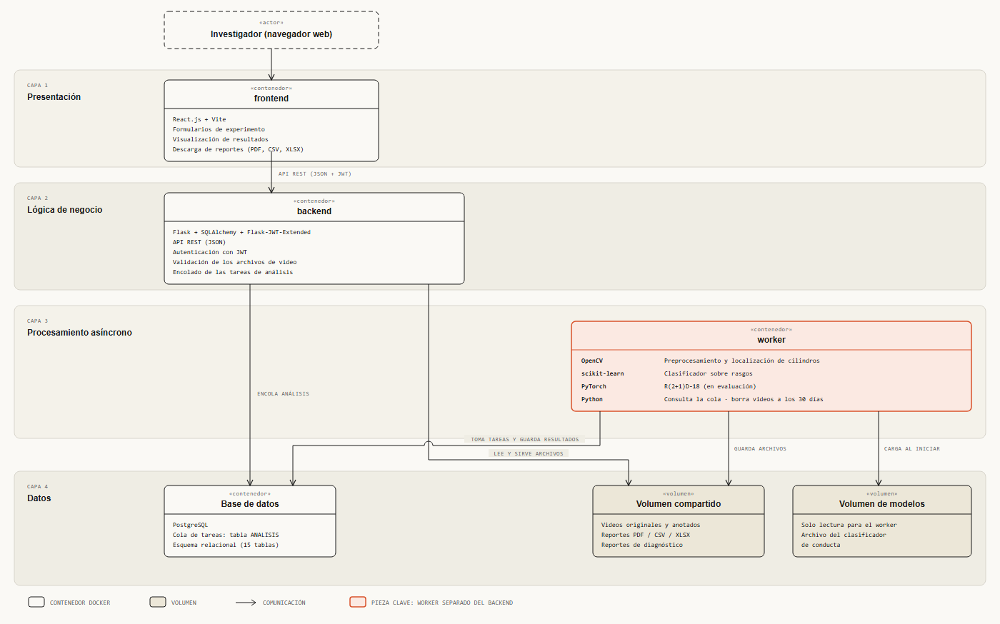

# Arquitectura de software por capas



Archivo interactivo: [arquitectura_capas.html](arquitectura_capas.html) (se abre en el navegador).
Versión en PlantUML del documento: [`../arquitectura_software.puml`](../arquitectura_software.puml).

## Qué muestra

Qué tecnología vive en cada capa del sistema y cómo se comunican las capas. Es la
vista de **estructura**: responde «¿de qué está hecho el sistema?». La vista de
**dónde corre** (servidor, navegador, correo) está en [despliegue.md](despliegue.md).

| Capa | Contenedor | Tecnología | Qué hace |
|------|------------|------------|----------|
| 1. Presentación | `frontend` | React.js + Vite | Formularios de experimento, visualización de resultados, descarga de reportes (PDF, CSV, XLSX) |
| 2. Lógica de negocio | `backend` | Flask + SQLAlchemy + Flask-JWT-Extended | API REST (JSON), autenticación con JWT, validación de los archivos de video, encolado de las tareas de análisis |
| 3. Procesamiento asíncrono | `worker` | Python, OpenCV, scikit-learn, PyTorch | Ejecuta el pipeline: preprocesamiento, localización de los cilindros y clasificación de conducta |
| 4. Datos | `db` + 2 volúmenes | PostgreSQL, sistema de archivos | Esquema relacional (15 tablas), videos y reportes (volumen compartido), modelo entrenado (volumen de modelos) |

## Cómo leer las flechas

- **Investigador → frontend → backend:** el navegador carga la interfaz y esta habla con
  el backend solo por API REST (JSON + JWT). El frontend no toca la base de datos ni los
  archivos.
- **Backend → base de datos («encola análisis»):** al subir un video válido, el backend
  crea un registro en la tabla `ANALISIS` con estado «en cola».
- **Worker → base de datos («toma tareas y guarda resultados»):** el worker consulta esa
  misma tabla cada cierto tiempo (*polling*), toma un análisis, lo pasa a «procesando» y
  al final a «completado» o «error». **No hay una cola de mensajes aparte** (ni Redis ni
  Celery): la cola es la tabla.
- **Backend → volumen compartido:** lee y sirve al frontend los archivos generados.
- **Worker → volumen compartido:** guarda videos anotados, reportes y reportes de
  diagnóstico.
- **Worker → volumen de modelos:** carga el archivo del clasificador al iniciar el
  contenedor. El volumen es de solo lectura para el worker.

## Por qué el worker está resaltado

Es la decisión de diseño que el capítulo 5 pone por delante: ejecutar el pipeline dentro
del backend bloquearía todas las peticiones HTTP mientras un video de 20 minutos se
procesa. Separarlo cuesta complejidad de despliegue (un proceso más, comunicación entre
procesos), pero permite atender otras peticiones y, si hace falta, escalar el número de
workers por separado (RF-12, RF-15).

## Dónde sale cada dato

- Capítulo 5, sección «Arquitectura general del sistema» (contenedores, responsabilidades,
  cola por *polling*, volumen de modelos).
- Capítulo 5, «Módulo 1 a 3» (qué hace OpenCV, scikit-learn y PyTorch dentro del worker).
- Capítulo 4: RNF-08 (borrado de videos a los 30 días, tarea diaria que corre en el
  worker).
- Número de tablas (15): `grafo_relacional_3_vigente.puml`.

## Diferencias con `arquitectura_software.puml`

Se corrigieron dos cosas que el `.puml` todavía trae y que el documento contradice:

1. **«Corrección CLAHE» en el worker.** El capítulo 5 dice que el sistema *no* aplica
   ninguna corrección de contraste; el preprocesamiento es registro de cámara y modelo de
   fondo. Aquí OpenCV aparece como «Preprocesamiento y localización de cilindros».
2. **«HTTPS» en la flecha del navegador.** No aparece en ningún capítulo del 1 al 5. Aquí
   la flecha dice solo «API REST (JSON + JWT)».

Además se agregó al worker el borrado diario de videos a los 30 días, que el capítulo 5
le asigna y el `.puml` no mostraba.

**El `.puml` y el documento LaTeX no se modificaron.** Si se quiere propagar esto, hay que
pedirlo aparte.

## Cómo regenerarlo

```bash
python diagramas/diagram_design/generadores/gen_capas.py diagramas/diagram_design/arquitectura_capas.html
```
