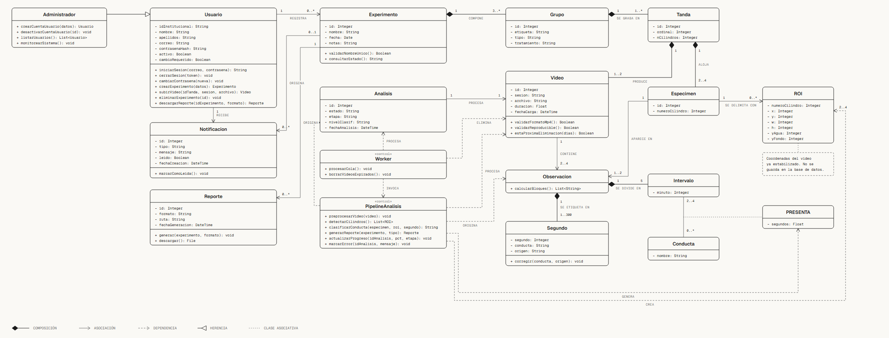

# Diagrama de clases completo (18 clases)



Archivo interactivo: [clases_completo.html](clases_completo.html) (ocupa toda la altura
de la pantalla y se desliza en horizontal).
Fuente de los datos: [`../clases.puml`](../clases.puml).

## Qué es esta prueba

Es una prueba de cómo se vería el diagrama de clases con el estilo de la skill
*diagram-design*, **rompiendo a propósito su regla de máximo 7 clases por diagrama**. La
skill recomienda partirlo por paquete; aquí están las 18 clases y las 24 relaciones en una
sola vista.

## Zonas del diagrama

| Zona | Clases |
|------|--------|
| Arriba a la izquierda (autenticación y usuarios) | `Administrador`, `Usuario`, `Notificacion`, `Reporte` |
| Arriba al centro y a la derecha (experimentos y video) | `Experimento`, `Grupo`, `Tanda`, `Especimen`, `Video` |
| Centro (pipeline de análisis) | `Analisis`, `Worker`, `PipelineAnalisis`, `ROI` |
| Derecha (resultados) | `Observacion`, `Intervalo`, `Conducta`, `PRESENTA`, `Segundo` |

## Relaciones

- **Herencia:** `Administrador` hereda de `Usuario` (no es un tipo aparte: es un usuario
  con permisos adicionales).
- **Composición (rombo lleno):** `Experimento` → `Grupo` → `Tanda` → `Especimen` y
  `Video`; `Observacion` → `Intervalo` y `Segundo`. Si el contenedor desaparece, sus
  partes también.
- **Asociación:** `Usuario` registra `Experimento` y recibe `Notificacion`; `Experimento`
  origina `Reporte` y `Notificacion`; `Analisis` procesa un `Video`; `Especimen` y `Video`
  aparecen en `Observacion`.
- **Dependencia (línea punteada):** el `Worker` invoca a `PipelineAnalisis` y procesa
  `Analisis`; el pipeline crea `ROI` y actualiza `Analisis`, y origina `Observacion` y
  `PRESENTA`.
- **Clase asociativa:** `PRESENTA` cuelga de la relación `Intervalo`–`Conducta` y guarda
  los segundos.
- **Estereotipo `«control»`:** `Worker` y `PipelineAnalisis` son clases de control, no de
  datos.

## Multiplicidades que conviene tener presentes

- Un experimento tiene al menos 3 grupos; un grupo, al menos 1 tanda.
- Una tanda aloja de 2 a 4 especímenes y produce 1 o 2 videos.
- Una observación se divide en exactamente 5 intervalos y en de 1 a 300 segundos (300 es
  un máximo, sin mínimo: se analizan los últimos 300 s del video).

## Qué se ve bien y qué no

**Bien:** letra legible, líneas rectas, sin cruces confusos, miembros completos y la
vista de conjunto en una pantalla.

**Mal:**

- Es demasiado ancho para una página de LaTeX; reducido a ancho de hoja, el texto de 9 px
  queda ilegible.
- La zona central (`Worker`, `PipelineAnalisis`, `Analisis`, `Video`) queda apretada, con
  seis flechas punteadas.
- La flecha «PROCESA» de `PipelineAnalisis` a `Analisis` no tiene etiqueta y las dos
  «ORIGINA» desde `Experimento` se parecen.
- La flecha «GENERA» hacia `PRESENTA` da la vuelta por abajo de todo el diagrama.

## Verificación contra el grafo relacional

Los atributos de las clases de datos coinciden con `grafo_relacional_3_vigente.puml`
(se comparó clase por clase; las llaves foráneas no aparecen como atributos, como es
normal en un diagrama de clases).

**`ROI` es una clase transitoria del pipeline.** Sus atributos (`numeroCilindro`, `x`, `y`,
`w`, `h`, `yAgua`, `yFondo`) no están en el grafo vigente a propósito: el grafo dice que la
región de cada cilindro se calcula en cada corrida y no se guarda (ver «Qué NO entra:
ROIS»). El diagrama lo indica con una nota: «Coordenadas del video ya estabilizado. No se
guarda en la base de datos.» Lo único que se guarda de ese recorte es la conducta de cada
segundo, que cuelga de `Observacion` y `Segundo`.

Cambios aplicados al `ROI` (8-oct, tras la revisión de quien construye el clasificador):

- Atributos nuevos: `numeroCilindro`, `yAgua` y `yFondo` (altura de la superficie y del
  fondo del tubo).
- Asociación `Especimen 1 — 0..* ROI` («se delimita con»), para saber de qué cilindro es
  cada recuadro. No identifica el video, y no hace falta: el video lo da `Observacion`.
- Multiplicidad `2..4` en «CREA» (de `PipelineAnalisis` a `ROI`).
- Firma nueva: `clasificarConducta(especimen, roi, segundo): String`. El clasificador
  decide cada segundo con una ventana de 4 s recortada con el `ROI`, no por fotograma.

**Lo que no se agregó, a propósito:** `confianza` en `Segundo` ni ningún otro dato que
entregue el modelo salvo la conducta (el modelo entrenado solo entrega la conducta de cada
segundo), ni `bloque` en `ROI` (solo haría falta si la web dibujara el recuadro sobre el
video original), ni los valores de `origen` `humano_ciego` y `sin_revisar`, que el
documento no tiene.

**`Observacion` no tiene atributos, y es correcto:** en el grafo esa tabla solo tiene su
número y los enlaces al espécimen y al video. Representa «un espécimen en un video». Tiene
una sola función, `calcularBloques()`, que agrupa sus segundos en bloques de 5 s: la
conducta del bloque es la de su último segundo, como en el muestreo cada 5 s de Detke
et al. (1995) (RN-15, RF-18). Los bloques se calculan al mostrarse y no se guardan en la
base de datos.

Los **métodos** no tienen contraparte en el grafo (es esquema de datos); se copiaron de
`clases.puml` sin verificarlos contra ningún otro documento.

## Cómo regenerarlo

```bash
python diagramas/diagram_design/generadores/gen_clases.py diagramas/diagram_design/clases_completo.html
```
