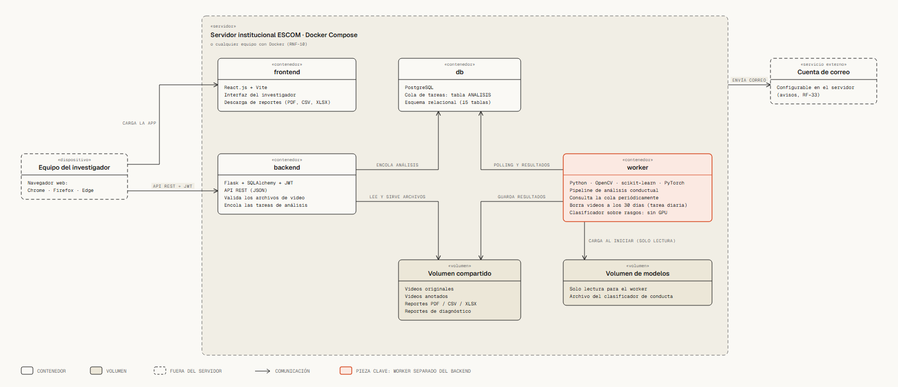

# Diagrama de despliegue



Archivo interactivo: [despliegue.html](despliegue.html) (se abre en el navegador y se
desliza en horizontal).

## Qué muestra

**Dónde corre cada pieza** del sistema: qué hay en el equipo del investigador, qué hay
dentro del servidor y qué queda fuera de él. Es la vista de **despliegue** que pide la
ISO/IEC/IEEE 42010 (estructural, comportamiento y despliegue). La vista de qué tecnología
tiene cada capa está en [arquitectura_capas.md](arquitectura_capas.md).

## Los nodos

| Nodo | Qué contiene | Fuente |
|------|--------------|--------|
| Equipo del investigador | Navegador web: Chrome, Firefox o Edge, sin instalar nada | RNF-07 |
| Servidor institucional ESCOM (Docker Compose) | Cuatro contenedores y dos volúmenes | RNF-10, cap. 5 |
| Cuenta de correo | Servicio externo, configurable en el servidor | RF-33 |

Dentro del servidor:

- **frontend:** React.js + Vite.
- **backend:** Flask + SQLAlchemy + JWT. Valida los videos y encola los análisis.
- **worker:** pipeline de análisis (OpenCV, scikit-learn, PyTorch). Consulta la cola
  periódicamente y borra los videos a los 30 días con una tarea diaria. El clasificador
  sobre rasgos corre en procesador, sin GPU.
- **db:** PostgreSQL. La cola de tareas es la tabla `ANALISIS`.
- **Volumen compartido:** videos originales, videos anotados, reportes y reportes de
  diagnóstico.
- **Volumen de modelos:** el archivo del clasificador; solo lectura para el worker.

## Cómo se comunican

El navegador carga la aplicación desde el frontend y habla con el backend por API REST
(JSON + JWT). Backend y worker no se hablan directamente: se coordinan a través de la
base de datos (el backend encola, el worker toma tareas por *polling*). Los dos usan el
volumen compartido; solo el worker carga el volumen de modelos.

## Lo que el documento dice sobre el entorno

- **Portabilidad (RNF-10):** el sistema debe levantarse con Docker Compose en el servidor
  institucional, sin dependencias adicionales en el equipo anfitrión.
- **Hardware:** no requiere infraestructura especializada; cualquier equipo con Docker
  puede correr el prototipo (cap. 4, factibilidad técnica).
- **Alcance:** el despliegue permanente en el servidor institucional de la ESCOM está
  fuera del alcance de este Trabajo Terminal (cap. 1). Por eso el diagrama dice «o
  cualquier equipo con Docker».
- **Disponibilidad (RNF-03):** ≥ 95 % mensual en el entorno de despliegue.
- **Almacenamiento (RNF-08 y RNF-09):** alerta al administrador a 80 % de uso del disco y
  limpieza automática de los videos más antiguos a 90 %.

## Pendientes

- **¿Qué contenedor envía los correos?** El documento solo dice que salen «desde una
  cuenta de correo configurable en el servidor» (RF-33). Por eso la flecha sale del borde
  del servidor y no de un contenedor. Si se decide, hay que moverla.
- **HTTPS.** El `arquitectura_software.puml` lo muestra, pero ningún capítulo del 1 al 5
  lo menciona; no se dibujó. Si el servidor lo va a usar, habría que escribirlo primero
  en el documento.

## Cómo regenerarlo

```bash
python diagramas/diagram_design/generadores/gen_despliegue.py diagramas/diagram_design/despliegue.html
```
